# 프로그램 설치 및 실행 가이드

## 1. 문서 개요

### 1.1 이 프로그램의 목적

한글 문서(`.hwp`, `.hwpx`)나 PDF 파일을 넣으면, 그 안의 글을 읽습니다. 그 다음에는 SBERT를 사용한 정량화 및 K-Means 군집화를 거쳐, LLM 기반 사고원인 구조화 레이블링까지 이어지는 4단계 파이프라인입니다.

**STEP 1 — 전처리** (`step_1_process/`, 2~14장)

1. 문서 안의 모든 글(문단)을 텍스트로 추출
2. 문장 단위 정리
3. "사건 개요 / 일시 / 장소 / 사고 경위" 이 4가지 항목에 해당하는 내용을 찾음
4. 이 모든 결과를 JSON(정해진 형식의 텍스트 데이터)으로 산출물 도출

**STEP 2 — SBERT 유사도 정량화** (`step_2_process/`, 15장)

5. STEP 1 산출물을 5개 한국어 SBERT 모델로 임베딩하고, 문서 쌍 사이의 코사인 유사도를 계산해 모델별 성능을 벤치마크·비교

**STEP 3 — K-Means 군집화** (`step_3_process/`, 16장)

6. STEP 2에서 채택된 임베딩으로 K-Means 군집화(Elbow+Silhouette으로 군집 수 자동 탐색)를 수행하고, 군집별로 두드러지는 사고 원인 키워드를 워드클라우드로 도출

**STEP 4 — LLM 기반 사고원인 구조화 레이블링** (`step_4_process/`, 17장, 실험 단계)

7. 군집별 특징 키워드와 대표 문장을 LLM에 입력해, 사전 정의된 사고원인 분류 체계에 맞춰 구조화된 라벨을 도출 — OpenAI API 경로와 DGX Spark 로컬 LLM 경로 두 가지를 병행 검토

전체 결과는 하나의 통합 웹 리포트(`gui_web/report.php` 또는 정적 스냅샷 `report.html`, 18장)에서 STEP 1~4를 한 페이지로 확인할 수 있습니다.

> 참고 : 해당 프로그램은 오로지 `KMST`(해양안전심판원)부터 제공을 받을 수 있는 `재결요약서`(선박 사고 관련 공문서) 형태의 문서를 다루도록 작성이 되었으나, 다른 도메인의 법적인 문서를 전처리하려는 사용자에게도 해당 프로그램이 도움이 일부 될 수 있음을 미리 서두에 밝혀둠

### 1.2 이 문서를 읽어야 할 사람

- 이 프로그램을 처음 설치/빌드하는 개발자
- 결과가 잘 나오는지 확인하고 싶은 사용자
- 배포하거나 다른 사람에게 설명해야 하는 담당자

### 1.3 지원 범위

| 항목               | 내용                                                                                                          |
| ------------------ | ------------------------------------------------------------------------------------------------------------- |
| 지원 운영체제      | Linux (개발/검증 완료), macOS (설치 명령은 제공하나 일부 항목은 실제 macOS에서 검증 필요 — 문서 곳곳에 표시) |
| 지원하지 않는 환경 | Windows (네이티브 실행 불가에 가까움 — 이 가이드에서 다루지 않음)                                            |
| 지원 입력 형식     | `.hwp`, `.hwpx`, `.pdf`                                                                                 |
| 미지원/미검증      | 암호화된 HWP/PDF, 매우 복잡한 표·수식 위주 문서 (동작할 수도 있지만 정확도는 보장하지 않음)                  |

### 1.4 폴더 구조

프로젝트 최상위(`step_1/`) 아래가 역할별로 나뉘어 있습니다 — 전처리 파이프라인 본체(`step_1_process/`), 결과 시각화(`gui_web/`), 그리고 STEP 2/3/4 각각의 작업 폴더(`step_2_process/`, `step_3_process/`, `step_4_process/`).

이 문서의 명령어 예시는 별다른 언급이 없으면 **`step_1_process/` 안에서 실행하는 것을 기준**으로 하며, STEP 2 이후는 각 장 시작 부분에 실행 위치를 다시 명시합니다.

```
root/
├── gpu_run.sh         ← STEP 1 실행 진입점(12.1절)
├── step_1.log         STEP 1 실행 로그가 쌓이는 곳(gpu_run.sh가 append)
├── config/
│   └── config.php     OpenAI API 키, HF_TOKEN 등 STEP 4가 쓰는 비밀값(17장)
├── step_1_process/   ← 전처리 파이프라인 본체(이 문서 2~14장이 다루는 대부분)
│   ├── data/                       원본 hwp/hwpx/pdf
│   ├── data_output/                처리 결과 JSON
│   ├── build/                      빌드된 body_decoder 실행 파일
│   ├── cpp/, hpp/                  C++ 소스
│   ├── pdf_decoder_py/             PDF→OCR 파이썬 파이프라인
│   ├── tests/regression_test.py    회귀 테스트
│   └── step_1_run_decoder_data.sh  데이터 일괄 실행 스크립트(12장, gpu_run.sh가 호출)
├── step_2_process/   ← STEP 2: SBERT 임베딩·벤치마크(15장)
│   ├── from_step1/step1_dataset.jsonl   STEP 1 산출물을 그대로 읽을 수 있게 정리한 것(12.5절)
│   ├── embed.py, tsne.py, similarity_graph.py   임베딩 생성 / 2·3D 투영 / 이웃 그래프(Python)
│   ├── models/, sbert_env/                다운로드한 모델 캐시 / GPU venv (gitignore 대상)
│   ├── embeddings/                        모델별 float32 임베딩(.bin) + meta.csv + benchmark_results.csv
│   └── cpp/benchmark.cpp, Makefile        모델별 유사도 벤치마크(C++)
├── step_3_process/   ← STEP 3: K-Means 군집화(16장)
│   ├── from_step2/                 STEP 2에서 채택된 모델의 임베딩만 인계
│   ├── cpp/kmeans.cpp, Makefile     K-Means + Elbow/Silhouette 자동 K탐색(C++)
│   ├── keywords.py, wordcloud_gen.py, join_tsne.py   Komoran 키워드 추출 / 워드클라우드 / 좌표 조인(Python)
│   └── output/                     clusters.csv, k_selection.csv, cluster_keywords.csv, wordcloud_cluster_*.png
├── step_4_process/   ← STEP 4: LLM 구조화 레이블링(17장, 실험 단계)
│   └── local_llm_server.py         DGX Spark 로컬 LLM 서버(FastAPI, OpenAI 호환 API, 다중 모델 비교)
└── gui_web/          ← 결과 시각화 전용(STEP 1~4 통합 리포트, 18장)
    ├── report_template.html        모든 STEP을 한 페이지에 담는 공유 템플릿
    ├── generate_report.py          report.html 정적 빌드(STEP2/3 빌더를 모듈로 불러옴)
    ├── report.php                  실시간 통합 리포트(PHP 내장 서버로 구동)
    ├── lib_step2_data.php, lib_step3_data.php, lib_llm_common.php   PHP 데이터 로더(재사용 라이브러리)
    ├── api_llm_label.php           STEP4 분기1(OpenAI) 엔드포인트
    ├── api_local_llm_health.php, api_local_llm_label.php   STEP4 분기2(로컬 LLM) 엔드포인트
    └── assets/                     로고, 워드클라우드 이미지 등 정적 자산
```

- `gpu_run.sh`는 `step_1/` 바로 아래 있고, 실제 작업 스크립트(`step_1_run_decoder_data.sh`)는 `step_1_process/` 안에 있습니다 — `gpu_run.sh`가 venv 활성화 후 그 디렉터리로 이동해서 실행하므로, 사용자는 `step_1/`에서 `./gpu_run.sh`만 실행하면 됩니다.
- `gui_web/`이 `step_1_process/`와 분리돼 있으므로, `postprocess_review.py`는 `step_1_process/`에서 `../gui_web/postprocess_review.py`로 상대경로 호출되고, `report.php`/`generate_report.py`는 반대로 `../step_1_process/data`, `../step_2_process/embeddings`, `../step_3_process/output` 등을 상대경로로 읽습니다. 이 폴더들 중 하나만 옮기면 상대경로가 깨지니, 항상 `step_1/` 바로 아래 나란히 두어야 합니다.

> 각 STEP에서 Python과 C++을 어떻게 나눠 썼는지에 대한 설계 근거·기준선(baseline)은 [Layer.md](Layer.md)를 참고하세요.

---

## 2. 전처리 프로그램의 아키텍처

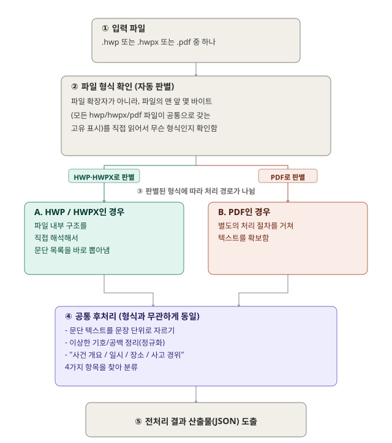

- ④번 "공통 후처리"는 HWP/HWPX/PDF 어떤 경로로 왔든 **똑같은 코드 한 벌**이 처리합니다.
- PDF도 결국 이 ④번 단계를 거치도록 만들어져 있는데, 그 과정이 조금 독특합니다. 아래 3번에서 이어서 설명합니다.
- 전처리 버그 수행 리포트 : [전처리 과정 기록](<./전처리 과정 기록.md>)

## 3. PDF 처리 상세 흐름

- PDF는 HWP/HWPX와 달리 "이 프로그램이 알아서 읽을 수 있는 형식"이 아니라서, 텍스트를 확보하는 과정이 여러 단계로 나뉩니다.
- 그리고 확보한 텍스트를 ④번 공통 후처리로 넘기기 위해 약간의 "변장"을 시킵니다.

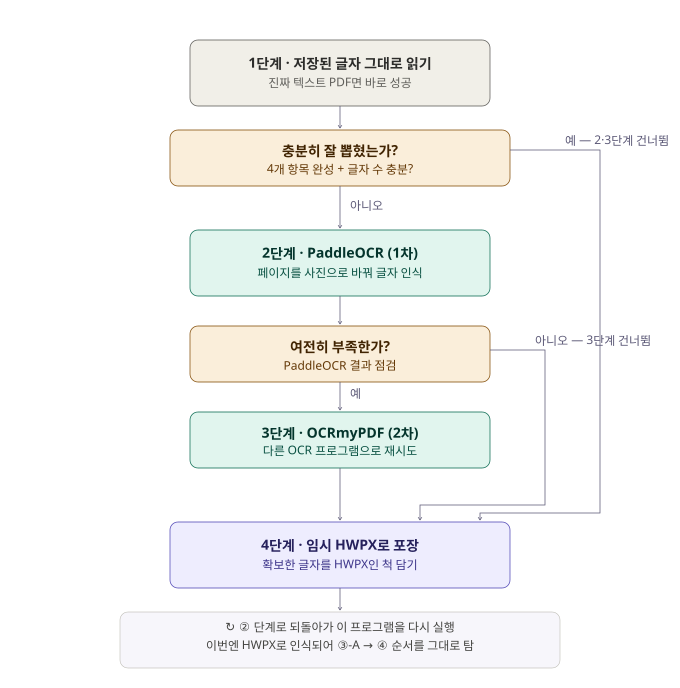

### 3.1`네이티브 텍스트`부터 시도하는 정의

OCR(사진 속 글자 읽기)은 시간도 오래 걸리고, 사람이 쓴 글자를 잘못 읽는 실수(오탈자)도 생깁니다. 반면 PDF 안에 이미 저장된 진짜 글자 데이터를 그대로 꺼내는 건 훨씬 빠르고 100% 정확합니다.

그래서 항상 `"먼저 진짜 글자가 있는지 확인 → 있으면 그걸로 끝 → 없거나 부족할 때만 사진으로 바꿔서 OCR"`이라는 순서를 지킵니다.

### 3.2 PaddleOCR에 대한 문서 레이아웃 이해도

재결요약서는 대부분 "왼쪽에 짧은 라벨(사건명, 판시요지 등), 오른쪽에 긴 본문"이 나란히 있는 표 형태이고, 문서에 따라 두 페이지를 나란히 스캔해서 한 장의 PDF 페이지로 만든 경우("2단" 레이아웃)으로 확인이 되었습니다.

이 두 가지 레이아웃 특성 때문에 OCR이 글자를 인식하는 순서가 뒤죽박죽되기 쉽고, 특히 "사고 경위"처럼 여러 줄에 걸친 긴 문장이 중간에 잘려버리는 문제가 있었습니다.

지금은 다음 두 가지 보정이 들어가 있습니다.

- **라벨열/본문열 분리**: 텍스트 상자들의 좌우 위치를 분석해서 "왼쪽 라벨 열"과 "오른쪽 본문 열"을 구분한 뒤, 라벨을 기준점 삼아 그 사이사이에 본문 줄을 끼워 넣는 방식으로 순서를 재구성합니다. 단순히 "왼쪽 다 읽고 오른쪽 다 읽기" 방식은 라벨 없는 문장이 뒤에 나오는 라벨보다 먼저 나와야 하는데 뒤로 밀리는 문제가 있어서, 지금은 라벨의 위치를 기준으로 본문을 끼워 맞추는 방식을 씁니다.
- **2단(가로로 나란히 스캔된 두 페이지) 분할**: PDF 페이지가 "landscape_two_up"(가로로 긴 한 장에 왼쪽 페이지+오른쪽 페이지가 나란히 있는 경우)으로 판정되면, 페이지 이미지를 좌우로 물리적으로 잘라서 각각 별도 페이지처럼 OCR합니다. 이 분할이 없으면 왼쪽 페이지 끝부분과 오른쪽 페이지 시작부분이 뒤섞여서 "사고 경위" 문장이 페이지 경계에서 끊기는 문제가 있었습니다.

> **참고**: 이 두 가지 보정은 PaddleOCR(2단계) 경로에만 있습니다. OCRmyPDF(3단계, 보조 엔진)는 이런 레이아웃 보정이 없어서, 2단으로 스캔된 문서를 PaddleOCR 없이 OCRmyPDF만으로 처리하면 결과 품질이 떨어질 수 있습니다. 2단 스캔 문서를 다뤄야 한다면 PaddleOCR 설치를 권장합니다.

### 3.3 "HWPX 파일인 척하는 임시 포장지" 정의

- **배경**: "사건 개요/일시/장소/사고 경위 4가지를 정확히 찾아내는 로직"은 이미 HWPX 파일을 처리하는 코드 안에 다 만들어져 있습니다(위 그림의 ④번). 이 로직은 잘 검증되어 있고, 절 제목(예: "주문", "참고사항", "교훈" 같은 문서 안의 다른 항목 이름)을 알아보고 헷갈리지 않게 걸러내는 등 세밀한 처리가 되어 있습니다.**문제**: 이 로직은 "HWPX 파일"이라는 정해진 포장 형식(정확히는 특정 구조를 가진 압축 파일, 뒤에서 설명)으로 들어온 입력만 처리하도록 짜여 있습니다.

따라서, PDF에서 뽑아낸 `"그냥 텍스트 문자열"`은 이 형식이 아니라서 곧바로 넣을 수 없습니다.

**해결 방법 (비유로 이해하기)**: 이미 "한글 파일(HWPX)만 채점할 수 있는 채점기"가 있다고 생각해 보세요. PDF용 채점기를 새로 만드는 대신, PDF에서 얻은 답안지(텍스트)를 한글 파일과 똑같이 생긴 봉투에 넣어서, 기존 채점기에 "이거 한글 파일이야" 하고 다시 넣어주는 것입니다. 채점기 입장에서는 진짜 한글 파일인지 아닌지 상관없이, 봉투 모양만 맞으면 정상적으로 채점(=분석)합니다.

##### Code Pipeline

1. PDF에서 확보한 텍스트(1~3단계 중 어디서 얻었든)를 문단 하나하나로 나눕니다.
2. 이걸 실제 `HWPX` 파일과 똑같은 내부 구조(특정 이름의 폴더/파일들이 들어있는 압축 파일)를 갖는 **임시 파일**로 저장합니다. 이 임시 파일은 컴퓨터의 임시 저장 공간에 잠깐 만들어졌다가, 처리가 끝나면 자동으로 삭제됩니다(디스크에 흔적이 남지 않음).
3. 이 임시 파일의 경로를 가지고 **이 프로그램(`body_decoder`) 자기 자신을 한 번 더 실행**합니다.
4. `body_decoder`는 이게 원래 PDF에서 왔다는 사실을 전혀 모르고, 그냥 "`HWPX` 파일이 들어왔다"고 인식하고 평소처럼 ③-A → ④번 순서로 정상 처리합니다.
5. 그 결과로 나온 JSON을 그대로 가져와서, PDF에만 있는 몇 가지 추가 정보(OCR을 몇 번 시도했는지 등)만 덧붙여서 최종 결과로 냅니다.

> `PDF 전용 "4가지 항목 찾기"` 로직을 따로 또 만들지 않고, 이미 있는 HWPX용 로직을 재사용하기 위한 우회로입니다.

### 3.4 "사건 개요"는 사실 "관련선박" 표에서 온다.

> 처음엔 "사건 개요"를 판시요지("가. ~~~ 나.~~~" 형태의 서술형 요약) 문단에서 찾도록 만들었는데, 실제 "재결요약서" 문서 대부분에서 "사건 개요"라는 라벨이 실제로 가리키는 자리는 그 문단이 아니라 문서 맨 위의 **"관련선박" 표**(선명/용도/총톤수/운항자/피해 등)였습니다. 게다가 판시요지 라벨도 문서마다 "판시요지" 대신 "판시사항"으로 적혀 있거나, 요약 문장이 "~사안"/"~사건"이 아니라 "~발생함" 같은 다른 말로 끝나는 경우가 많아서 서술형 패턴 자체가 잘 안 맞았습니다.

그러므로, 아래와 같은 순서로 "사건 개요"를 찾습니다.

1. 먼저 판시요지/판시사항 서술형 패턴("가. ... 나.")을 시도
2. 못 찾으면 "관련선박" 표 블록(다음 라벨인 "일시"/"장소"/"사고경위"가 나오기 전까지)을 통째로 가져와 `관련선박: ...` 형태로 채택

이 수정 전에는 "사건 개요"가 비거나(값 없음), "사고 경위"와 똑같은 문장이 중복으로 들어가거나, 엉뚱한 문장 파편이 잘려 들어가는 경우가 검토 필요(needs_review) 사례의 대부분(818건 중 30건 중 28건)을 차지했습니다.

### 3.5 "사고 경위"가 없으면 "사고발생원인"에서 대신 찾습니다.

**일부 문서**(주로 hwp/hwpx native 경로)는 "재결요약서"(관련선박 표 + 일시/장소/사고경위 4항목)가 아니라 **"재결서" 원문 그대로**(이유/사실/주문 구조를 갖춘 정식 판결문)가 섞여 들어옵니다. 이런 문서엔 "사고경위"라는 라벨 자체가 아예 없고, 대신 "**나. 사고발생원인**"(또는 "사고발생 원인") 절에 사실상 같은 내용(사고가 어떻게 일어났는지 서술)이 담겨 있습니다.

그래서 "사고 경위" 라벨을 못 찾으면 "사고발생원인"/"사고발생 원인"으로 한 번 더 찾아봅니다(`hpp/body_decoder_postprocess.hpp`의 `accident_cause_fallback_rule()`). 이때 주의할 점이 하나 있는데, "사고발생원인" 절은 보통 "이 OOO사건은 ~~~ 발생한 것이다." 같은 **결론형 문장으로 곧바로 시작**합니다. 원래 "사고경위" 수집 로직은 이런 결론형 문장을 만나면 "서술이 끝나고 판단문이 시작됐다"고 보고 그 지점에서 수집을 멈추는데(정상적인 사고경위 문서에서는 맞는 동작), 사고발생원인 절은 애초에 그 문장으로 "시작"하므로 이 규칙을 그대로 적용하면 첫 문장부터 통째로 비어버립니다. 그래서 이 폴백 경로에서만 그 "판단문 재시작 감지"를 꺼둡니다.

이 폴백으로도 "사건 개요"까지 채워지진 않습니다 .

이런 문서엔 "관련선박" 표에 해당하는 자리가 없기 때문입니다(대신 "1. 사실" 절 아래 선명/선적항/선박소유자/총톤수 표가 있는데, 아직 자동 추출 대상은 아닙니다). 그래서 이런 문서는 대개 "사건 개요만 검토 필요"로 표시되고 나머지 3개 필드는 정상적으로 채워집니다.

---

## 4. 주요 구성 파일

| 파일 또는 경로                                | 역할                                                          |
| --------------------------------------------- | ------------------------------------------------------------- |
| `cpp/body_decoder.cpp`                      | 프로그램의 시작점(메인 실행 파일 소스)                        |
| `hpp/body_decoder_hwp.hpp`                  | HWP 파일을 직접 읽는 코드                                     |
| `hpp/body_decoder_hwpx.hpp`                 | HWPX 파일을 직접 읽는 코드                                    |
| `hpp/body_decoder_postprocess.hpp`          | 위 그림의 ④번(공통 후처리) / 문장 나누기, 4가지 항목 찾기   |
| `pdf_decoder_py/pdf_to_hwpx_then_decode.py` | 위 그림의 "PDF 처리 상세 흐름"(1~4단계) 담당                  |
| `pdf_decoder_py/paddle_ocr_fallback.py`     | 2단계(PaddleOCR)를 실제로 실행하는 코드                       |
| `run_test_data.sh`                          | `test_data/` 폴더의 여러 파일을 한 번에 테스트하는 스크립트 |
| `API.md`                                    | 개발자용 상세 기술 문서(스키마, 환경변수 전체 목록 등)        |

---

## 5. 전처리 프로그램 시스템 요구사항

### 5.1 공통 필수 소프트웨어

| 소프트웨어                    | 용도                                                                             | 사용처                                        |
| ----------------------------- | -------------------------------------------------------------------------------- | --------------------------------------------- |
| `C++17을 지원하는 컴파일러` | 사람이 쓴 프로그램 코드(C++)를 컴퓨터가 실행할 수 있는 실행 파일로 바꿔주는 도구 | `body_decoder` 실행 파일 생성               |
| `make`                      | 여러 빌드 명령을 자동으로 순서대로 실행해주는 도구                               | 빌드 자동화                                   |
| `zlib`                      | 압축/해제 기능을 제공하는 라이브러리                                             | HWP 파일 내부의 압축된 데이터를 푸는 데 필요  |
| `Python 3`                  | PDF 처리 스크립트를 실행하기 위한 언어                                           | PDF 파이프라인 실행                           |
| `Bash`                      | 명령어를 자동으로 순서대로 실행하는 셸(터미널) 프로그램                          | `run_test_data.sh` 실행                     |
| `Poppler`                   | PDF 파일을 다루는 도구 모음                                                      | PDF에서 글자 꺼내기, 페이지를 사진으로 바꾸기 |

### 5.2 선택 소프트웨어

- `GPU 가속`에 대해서는 `11.1`절을 참조할 것

| 소프트웨어                                             | 용도                                                | 미설치 시 동작                                                         |
| ------------------------------------------------------ | --------------------------------------------------- | ---------------------------------------------------------------------- |
| `PaddleOCR + PaddlePaddle`                           | 위 그림 "2단계" OCR                                 | 설치 안 돼 있으면 이 단계를 건너뛰고 3단계(OCRmyPDF)로 넘어감          |
| `OCRmyPDF`                                           | 위 그림 "3단계" OCR                                 | 설치 안 돼 있으면 이 단계를 건너뛰고, 이미 확보한 텍스트로 계속 진행   |
| `Tesseract`, `Ghostscript`, `unpaper, pngquant` | OCRmyPDF가 내부적으로 사용하는 부품                 | OCRmyPDF를 설치할 때 대부분 자동으로 같이 설치됨                       |
| `jq`                                                 | JSON 결과를 사람이 보기 좋게 정리해서 보여주는 도구 | 없어도 결과 파일 자체는 정상 생성됨, 터미널에 보기 좋은 요약만 안 나옴 |

> **중요**: **선택 소프트웨어**라고 적힌 것들은 하나도 없어도 프로그램이 에러로 멈추지 않습니다. 다만, PDF가 스캔 이미지 문서라서 OCR이 꼭 필요한 경우, OCR 도구가 하나도 없으면 그 문서의 4가지 항목을 못 찾을 수 있으며 속도가 느릴 수 있습니다.

### 5.3 Bash 관련 주의사항

`run_test_data.sh`는 `sh`(더 단순한 셸)가 아니라 **Bash 전용 문법**(목록을 다루는 배열, `[[ ]]` 조건문, 프로그램 종료 시 뒷정리를 해주는 `trap` 등)으로 작성되어 있습니다. 그래서 반드시 다음과 같이 실행해야 합니다.

```bash
bash ./step_1_run_decoder_data.sh
```

또는 실행 권한을 준 뒤:

```bash
chmod +x ./step_1_run_decoder_data.sh
./step_1_run_decoder_data.sh
```

`sh run_test_data.sh`처럼 `sh`로 직접 실행하면 문법 오류가 납니다.

---

## 6. macOS 환경 구축

> **참고**: 이 섹션의 설치 명령은 macOS 표준 관례를 따른 것이며, 이 프로젝트가 실제 macOS 환경에서 처음부터 끝까지 검증되지는 않았습니다. 특히 6.6절(PaddleOCR)의 Apple Silicon 관련 내용은 실행 전 반드시 확인이 필요합니다.

### 6.1 지원 환경

- Intel Mac, Apple Silicon(M1/M2/M3 등) Mac 모두 이론상 가능
- 특정 macOS 최소 버전을 못박아 검증하지는 않았으나, 비교적 최신 macOS(12 이상 권장)에서 시도하는 것을 권장

### 6.2 Xcode Command Line Tools 설치

터미널을 열고:

```bash
xcode-select --install
```

이걸로 다음이 함께 설치됩니다.

- C++ 컴파일러(Clang, `g++`라는 이름으로도 실행됨 — GNU 컴파일러가 아니지만 이 프로젝트가 요구하는 C++17 기능은 지원함)
- `make`
- zlib (macOS SDK에 기본 포함되어 있어 따로 설치할 필요가 보통 없음)

### 6.3 Homebrew 설치 확인

Homebrew는 macOS에서 가장 널리 쓰이는 패키지 관리자(Linux의 `apt`에 해당)입니다. 이미 설치돼 있다면:

```bash
brew --version
```

없다면 [brew.sh](https://brew.sh) 안내에 따라 설치합니다. Apple Silicon과 Intel Mac은 Homebrew 설치 경로가 다르지만(`/opt/homebrew` vs `/usr/local`), 공식 설치 스크립트를 그대로 따라가면 자동으로 맞게 설정됩니다.

### 6.4 필수 패키지 설치

```bash
brew install python poppler
```

### 6.5 선택 패키지 설치

```bash
brew install ocrmypdf jq
```

`ocrmypdf`를 Homebrew로 설치하면 Tesseract, Ghostscript 등 필요한 부품이 함께 설치됩니다.

### 6.6 PaddleOCR 설치 및 Apple Silicon 주의사항

```bash
python3 -m pip install paddleocr paddlepaddle
```

**주의**: `paddlepaddle`(PaddleOCR이 내부적으로 사용하는 딥러닝 엔진)은 macOS, 특히 Apple Silicon(M 시리즈) 환경에서 설치가 원활하지 않을 수 있습니다. 위 명령을 실행했을 때 오류가 난다면 아래를 참조하여 조치를 해주십시오.

- Python 버전을 확인하세요 (너무 최신이거나 너무 오래된 버전이면 안 될 수 있음).
- 설치가 안 되더라도 프로그램 전체가 멈추지 않습니다 — 아래처럼 PaddleOCR 단계를 꺼서 OCRmyPDF만으로 계속 쓸 수 있습니다.

```bash
export USE_PADDLE_OCR=0
```

(이 환경변수는 `run_test_data.sh`를 실행하기 직전에 설정하거나, `USE_PADDLE_OCR=0 ./run_test_data.sh`처럼 한 줄로 붙여서 씁니다.)

### 6.7 macOS의 Bash 버전

macOS에 기본 설치된 `/bin/bash`는 오래된 버전(3.2)입니다. 이 프로젝트의 `run_test_data.sh`는 이 버전에서도 문제없이 돌아가는 문법만 사용하므로, 최신 Bash를 별도로 설치할 필요는 없습니다.

---

## 7. Linux 환경 구축

이 프로젝트가 실제로 개발·검증된 환경입니다(Ubuntu 24.04 기준).

### 7.1 필수 패키지 설치

```bash
sudo apt update
sudo apt install build-essential zlib1g-dev python3 python3-pip python3-venv \
  poppler-utils
```

### 7.2 선택 패키지 설치

```bash
sudo apt install jq ocrmypdf
```

`ocrmypdf`를 apt로 설치하면 Tesseract, Ghostscript 등 필요한 부품이 자동으로 함께 설치됩니다(직접 하나씩 설치할 필요 없음).

### 7.3 PaddleOCR 설치

```bash
python3 -m pip install paddleocr paddlepaddle
```

> 시스템 Python이 "외부에서 관리되는 환경(externally-managed-environment)"이라는 오류를 낸다면, 가상환경을 만들어 그 안에서 설치하는 것을 권장합니다.
>
> ```bash
> python3 -m venv paddle_env
> source paddle_env/bin/activate
> pip install paddleocr paddlepaddle
> ```
>
> 이렇게 가상환경을 쓰는 경우, `run_test_data.sh`를 실행하기 전에 매번 `source paddle_env/bin/activate`로 가상환경을 켜줘야 PaddleOCR이 인식됩니다.

---

## 8. 설치 결과 확인

빌드하기 전에, 필요한 도구들이 잘 설치됐는지 먼저 확인합니다.

### 8.1 필수 도구 확인

```bash
c++ --version      # 또는 g++ --version
make --version
python3 --version
bash --version
pdftotext -v
pdftoppm -v
pdfinfo -v
```

전부 버전 정보가 출력되면 정상입니다. "command not found" 같은 메시지가 나오면 해당 도구가 설치되지 않은 것입니다.

### 8.2 선택 도구 확인

```bash
jq --version
ocrmypdf --version
```

### 8.3 Python 패키지 확인

```bash
python3 -c "import paddle; print(paddle.__version__)"
python3 -c "import paddleocr; print('PaddleOCR 사용 가능')"
```

여기서 오류가 나도 괜찮습니다(선택 사항이므로). 다만 오류가 나는데 OCR 결과가 필요하다면, 위 macOS/Linux 설치 절차를 다시 확인하세요.

---

## 9. 프로그램 빌드

### 9.1 프로젝트 폴더로 이동

```bash
cd <이 프로젝트를 내려받은 경로>
```

### 9.2 이전 빌드 결과 정리 (있다면)

```bash
make clean
```

### 9.3 빌드

```bash
make
```

또는 한 번에:

```bash
make clean && make
```

### 9.4 빌드 결과 확인

빌드가 끝나면 프로젝트 폴더 안에 `body_decoder`라는 실행 파일이 생겼는지 확인합니다.

```bash
ls -l body_decoder
```

`-rwxr-xr-x` 처럼 실행 권한(`x`)이 있는 파일이 보이면 성공입니다.

---

## 10. 기본 실행 방법

### 10.1 명령 형식

```bash
./body_decoder <입력 파일 경로> [auto|hwp|hwpx|pdf] [옵션들]
```

### 10.2 인수 설명

| 인수                  | 필수 여부 | 설명                                               |
| --------------------- | :-------: | -------------------------------------------------- |
| `<입력 파일 경로>`  |   필수   | 처리할 hwp/hwpx/pdf 파일 경로                      |
| `auto\|hwp\|hwpx\|pdf` |   선택   | 파일 형식을 직접 지정. 생략하면`auto`(자동 판별) |
| 옵션들                |   선택   | PDF 처리 방식을 세부 조정 (아래 11장 참고)         |

### 10.3 형식 자동 판별로 실행 (기본)

```bash
./body_decoder ./sample.pdf auto
```

앞서 설명했듯, 확장자가 아니라 파일 내용 맨 앞부분을 직접 읽어서 형식을 판별합니다. 그래서 확장자가 잘못 붙어 있어도(예: 실제로는 PDF인데 파일명이 `.txt`인 경우는 예외지만, `.hwp`인데 실제로 hwpx인 경우처럼) 실제 내용을 기준으로 정확히 처리합니다.

### 10.4 형식을 직접 지정해서 실행

```bash
./body_decoder ./sample.hwp hwp
./body_decoder ./sample.hwpx hwpx
./body_decoder ./sample.pdf pdf
```

### 10.5 경로에 공백이 있는 경우

파일 경로를 따옴표로 감싸주세요.

```bash
./body_decoder "/path/to/test files/sample.pdf" auto
```

---

## 11. PDF 처리 옵션 자세히 보기

`./body_decoder`를 PDF에 대해 실행할 때 붙일 수 있는 옵션들입니다(위 3번 그림의 "1~3단계" 동작을 제어).

| 옵션                        | 기본값      | 의미                                                                                                                          |
| --------------------------- | ----------- | ----------------------------------------------------------------------------------------------------------------------------- |
| `--ocr=auto\|always\|never` | `auto`    | `auto`: 1단계로 부족할 때만 OCR 시도(권장) / `always`: 무조건 OCR까지 시도 / `never`: OCR 아예 안 함(1단계 결과만 사용) |
| `--ocr-lang=`             | `kor+eng` | 3단계(OCRmyPDF)가 인식할 언어                                                                                                 |

이 외에 **환경변수**로 조절하는 값들이 있습니다.(명령줄 옵션이 아니라, 실행 전에 `이름=값` 형태로 지정)

| 환경변수                 | 기본값            | 의미                                                                                                                                                                                            |
| ------------------------ | ----------------- | ----------------------------------------------------------------------------------------------------------------------------------------------------------------------------------------------- |
| `PDF_RENDER_DPI`       | 240               | 2단계(PaddleOCR)에서 PDF 페이지를 사진으로 바꿀 때의 해상도. 숫자가 클수록 더 선명하지만 느려짐                                                                                                 |
| `PADDLE_OCR_MAX_PAGES` | 2                 | 2단계(PaddleOCR)가 처리할 최대 페이지 수 (아래 "주의" 참고)                                                                                                                                     |
| `USE_PADDLE_OCR`       | `auto`          | `0`으로 두면 2단계(PaddleOCR)를 아예 건너뜀                                                                                                                                                   |
| `PADDLE_OCR_DET_MODEL` | `mobile`        | PaddleOCR이 글자 위치를 찾을 때 쓰는 모델 종류. 기본값(`mobile`)은 가볍고 빠름(페이지당 CPU 기준 약 8.5초). `server`로 바꾸면 더 무겁지만 정확도가 약간 더 높은 모델을 씀(페이지당 약 31초) |
| `OCRMYPDF_TIMEOUT`     | 25(스크립트 기본) | 3단계(OCRmyPDF)가 이 시간(초) 안에 안 끝나면 실패로 처리하고 다음 단계로 넘어감                                                                                                                 |
| `KEEP_PDF_DEBUG`       | `0`             | `1`로 두면 각 단계의 중간 결과물(추출된 텍스트, 변환한 사진 등)을 `test_output/debug_pdf/` 폴더에 남겨서 나중에 확인 가능                                                                   |

> **주의 :  페이지 수 제한에 대해**: `PADDLE_OCR_MAX_PAGES`가 기본 2인 이유는, 이 프로그램이 다루도록 만들어진 재결요약서 문서가 대부분 1~2페이지 분량이기 때문입니다(빠른 처리를 위한 실용적 기본값). 하지만 **3페이지 이상인 문서에서는 3페이지째 이후의 내용이 OCR 대상에서 빠질 수 있습니다.** 실제로 테스트 데이터 중 3페이지짜리 문서가 있었는데, 다행히 필요한 4가지 항목이 모두 앞의 2페이지 안에 들어있어서 문제가 없었지만, 이는 우연일 수 있습니다. **페이지가 많은 문서를 다뤄야 한다면 `PADDLE_OCR_MAX_PAGES` 값을 문서 분량에 맞게 늘려서 사용하세요.**
>
> ```bash
> PADDLE_OCR_MAX_PAGES=5 ./body_decoder ./long_document.pdf auto
> ```

### 11.1 GPU 가속 (선택, 고급)

- **PaddleOCR은 기본적으로 CPU로 동작합니다.**
- 위에서 설명한 `PADDLE_OCR_DET_MODEL`을 경량(`mobile`)으로 두는 것만으로도 서버급 모델 대비 약 3.7배 빨라지지만(페이지당 약 31초 → 약 8.5초), GPU가 있는 서버라면 이보다 훨씬 더 빠르게 만들 수 있습니다.

  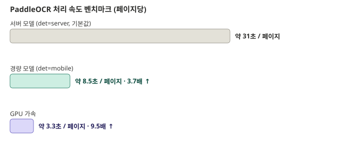

다만 GPU 사용은 **환경에 따라 난이도가 크게 다릅니다.**

- 일반적인 x86_64 서버 + NVIDIA GPU라면 `pip install paddlepaddle-gpu`로 간단히 끝나는 경우가 많습니다.
- 이 프로젝트가 개발된 서버처럼 **ARM64(aarch64) + 최신 CUDA 조합**인 경우, PaddlePaddle이 공식 GPU 배포판을 제공하지 않아서 **소스 코드를 직접 컴파일**해야 합니다.
- `cuDNN` 시스템 패키지 설치, 빌드 도구 준비, 약 20~40분의 컴파일 시간(컴퓨터 성능에 따라 상이), 디스크 약 9GB가 필요합니다.
- `paddlepaddle` 패키지 자체를 CPU용에서 GPU용으로 교체하는 작업입니다.

```bash
# 1) 컴파일 전용 가상환경 준비 및 소스 클론 (프로젝트 폴더 안 3rdparty/에 격리)
mkdir -p 3rdparty && cd 3rdparty
python3 -m venv paddle_build_env
source paddle_build_env/bin/activate
pip install numpy protobuf cython wheel setuptools
git clone --branch v3.4.0 --depth 1 https://github.com/PaddlePaddle/Paddle.git
cd Paddle && git submodule update --init --recursive
pip install -r python/requirements.txt

# 2) cmake 설정 (예: NVIDIA GB10류 ARM64 GPU 대상)
#    -DCUDA_ARCH_BIN 값은 사용 중인 GPU의 컴퓨트 능력(compute capability)에 맞게 바꿔야 합니다.
mkdir -p build && cd build
cmake .. \
  -GNinja \
  -DCMAKE_BUILD_TYPE=Release \
  -DWITH_GPU=ON \
  -DWITH_NCCL=OFF \
  -DWITH_TESTING=OFF \
  -DCUDA_ARCH_NAME=Manual \
  -DCUDA_ARCH_BIN="12.1" \
  -DWITH_ARM=ON \
  -DWITH_AVX=OFF \
  -DWITH_MKL=OFF \
  -DWITH_MKLDNN=OFF \
  -DWITH_TENSORRT=OFF \
  -DCMAKE_CUDA_FLAGS="-U__ARM_NEON -DEIGEN_DONT_VECTORIZE=1" \
  -DPYTHON_EXECUTABLE=$(which python3) \
  2>&1 | tee cmake_output.log

# 3) 빌드 (약 40분)
ninja -j$(nproc) 2>&1 | tee build_output.log

# 4) 빌드된 wheel을 실제 작업 가상환경에 설치
deactivate
source <작업용 venv>/bin/activate
pip install ./build/python/dist/paddlepaddle_gpu-*.whl
```

**주요 플래그 부연 설명**

| 플래그                                                         | 부연 설명                                                                                                                         |
| -------------------------------------------------------------- | --------------------------------------------------------------------------------------------------------------------------------- |
| `-DWITH_NCCL=OFF`                                            | NCCL은 여러 GPU 간 통신용 라이브러리라 GPU 1개 환경에는 불필요하며, 없으면 오히려 빌드가 실패할 수 있음(aarch64용 NCCL 헤더 부재) |
| `-DCUDA_ARCH_BIN="12.1"`                                     | 사용 중인 GPU의 컴퓨트 능력 버전. 다른 GPU라면 이 값을 바꿔야 함                                                                  |
| `-DWITH_ARM=ON`, `-DWITH_AVX=OFF`                          | x86 전용 명령어(AVX) 대신 ARM 경로 사용                                                                                           |
| `-DCMAKE_CUDA_FLAGS="-U__ARM_NEON -DEIGEN_DONT_VECTORIZE=1"` | Eigen 라이브러리가 ARM 벡터화와 CUDA 컴파일 중 충돌하는 것을 우회                                                                 |

설치 후 아래로 확인합니다.

```bash
python3 -c "import paddle; print(paddle.is_compiled_with_cuda())"   # True면 성공
```

컴파일 전용 가상환경(`paddle_build_env`)과 실제로 OCR을 돌리는 작업용 가상환경은 분리해서 관리하는 것을 권장합니다.

### 11.2 실행 예시 모음

```bash
# 기본값 그대로 (OCR은 필요할 때만)
./body_decoder ./sample.pdf auto

# OCR을 아예 하지 않고, PDF 안의 텍스트만 사용
./body_decoder ./sample.pdf pdf --ocr=never

# PaddleOCR 없이(설치 안 했거나 끄고 싶을 때) 실행
USE_PADDLE_OCR=0 ./body_decoder ./sample.pdf auto

# 중간 결과를 파일로 남겨서 디버깅
KEEP_PDF_DEBUG=1 ./body_decoder ./sample.pdf auto
```

---

## 12. 데이터 일괄 실행

`data/` 폴더에 있는 여러 hwp/hwpx/pdf 파일을 한 번에 처리하고 결과를 검증하는 스크립트입니다.

### 12.1 실행

GPU를 쓰려면 **반드시 GPU venv를 먼저 활성화**해야 합니다 — 워커 스크립트 자체는 venv를 활성화하지 않고 그때그때 PATH에 잡히는 `python3`를 그대로 씁니다. 매번 잊기 쉬워서 활성화까지 같이 해주는 래퍼(`gpu_run.sh`, **`step_1/` 바로 아래**에 있음)를 쓰는 걸 권장합니다.

```bash
cd step_1                 # 이 저장소를 어디에 두셨든, step_1/ 로 이동
./gpu_run.sh               # venv 활성화 → step_1_process/step_1_run_decoder_data.sh 실행 → step_1.log에 기록 (권장)

# 또는 수동으로(step_1_process/ 안에서 실행해야 함):
cd step_1_process
source ~/paddle_dev_test/bin/activate
bash ./step_1_run_decoder_data.sh
```

GPU venv를 활성화하지 않고 워커 스크립트를 직접 실행하면 시스템 기본 `python3`를 쓰게 되는데, 거기엔 `paddleocr`가 안 깔려 있어서 PaddleOCR 단계가 통째로 스킵되고 OCRmyPDF(CPU/Tesseract, 더 느리고 품질도 낮음)로 조용히 폴백됩니다.

`step_1_run_decoder_data.sh`가 하는 일

1. `make clean && make`로 새로 빌드
2. `data/` 폴더 안의 모든 `.hwp`/`.hwpx`/`.pdf` 파일을 찾아서
3. 하나씩 `body_decoder`로 처리하고
4. `postprocess_review.py`로 결과를 다시 열어 `needs_review`/`format_mismatch`를 계산해 채워 넣고(HWP/HWPX native 결과에도 동일하게 적용됨 — 원래는 PDF 경로에만 있던 개념)
5. 결과를 `data_output/<원본 파일명>.json`으로 저장 — **확장자를 포함한 파일명 전체**를 키로 씁니다(`제609천금호_선원부상사건.hwp.json`처럼). 같은 사건의 `.hwp`와 `.pdf`가 동시에 있어도 서로 안 덮어씁니다.
6. 진행률 바에 경과 시간과 함께 **남은 예상 시간**을 같이 보여주고, 성공/실패 개수를 마지막에 요약
7. 마지막으로 STEP 2 인계용 데이터셋까지 자동 생성(12.5절)

`gpu_run.sh`는 워커의 출력을 항상 `step_1/step_1.log`에 **append**합니다(자체 배너/섹션 헤더는 화면에만 찍힘). 그래서 백그라운드로 돌릴 때도 별도 리다이렉트 없이 그냥 `nohup ./gpu_run.sh &`로 띄운 뒤 `tail -f step_1.log`로 보면 됩니다 — 로그에는 `[진행] 120/818 (14%) · 경과 0:12:03 · 남은시간 1:12:40` 형태로 진행 상황이 파일마다 한 줄씩 남습니다.

### 12.2 PaddleOCR가 없을 때

PaddleOCR이 설치되어 있지 않아도 스크립트는 에러로 멈추지 않고, 다음과 같은 안내만 출력한 뒤 계속 진행합니다.

```
[INFO] PaddleOCR가 설치되어 있지 않습니다. 이 단계는 건너뛰고
[INFO] native 추출 -> OCRmyPDF fallback 순서로 계속 진행합니다.
```

### 12.3 옵션을 바꿔서 실행

11장에서 설명한 환경변수를 앞에 붙여서 실행하면 됩니다.

```bash
KEEP_PDF_DEBUG=1 PADDLE_OCR_MAX_PAGES=5 bash ./step_1_run_decoder_data.sh
```

### 12.4 결과 확인

- 처리된 각 파일의 결과: `data_output/<원본 파일명>.json` (확장자 포함, 예: `foo.pdf.json`)
- 처리 중 실제 오류가 있었던 파일만: `data_output/<원본 파일명>.stderr.log` (정상 처리된 파일은 이 로그 파일 자체가 생기지 않음)
- 전체 결과를 한눈에 보려면(1.4절 폴더 구조 참고, `gui_web/`에서 실행): `cd ../gui_web && python3 generate_report.py`로 `report.html`을 만들거나, `php -S localhost:8000` 후 `report.php`를 열어 실시간으로 봅니다. "검토필요" 배지의 물음표(`?`) 아이콘에 마우스를 올리면 왜 검토필요인지 사유가 뜨고, 표 아래에는 카테고리별 처리 현황 막대 차트가 있습니다.
- `jq`가 설치돼 있으면 터미널에 각 파일의 핵심 결과(추출된 4가지 항목 등)가 보기 좋게 요약되어 출력됨

### 12.5 STEP 2 인계용 데이터셋 내보내기

`step_1_run_decoder_data.sh`가 818건 처리를 마치면, 마지막 단계로 `data_output/*.json`을 훑어서 STEP 2(SBERT 유사도 정량화)가 바로 읽을 수 있는 JSONL 하나로 정리해 `../step_2_process/from_step1/step1_dataset.jsonl`에 저장합니다. 파이썬 없이 `jq`만으로 동작합니다.

레코드마다 담기는 필드

| 필드                                                | 내용                                                                                             |
| --------------------------------------------------- | ------------------------------------------------------------------------------------------------ |
| `id`                                              | 원본 파일명(확장자 제외)                                                                         |
| `category`                                        | 파일명 접두어(충돌/좌초/화재 등)                                                                 |
| `사건_개요` / `일시` / `장소` / `사고_경위` | STEP 1이 추출한 4개 필드 원문                                                                    |
| `embedding_text`                                  | **SBERT에 넣을 텍스트** — "사고 경위"를 우선 쓰고, 비어있으면 "사건 개요"로 대체          |
| `needs_review` / `field_confidence`             | STEP 1의 품질 신호를 그대로 전달(STEP 2/3에서 필요하면 걸러쓰라고 남겨둠, 여기서 미리 빼지 않음) |

`embedding_text`로 "사고 경위"를 우선 쓰는 이유: "사건 개요"는 상당수(3.4절의 관련선박 표 폴백 케이스)가 서술형이 아니라 "관련선박: 선명 용도 총톤수..." 같은 표 데이터라서, 사고 원인 유사도 비교에는 "사고 경위"만 코퍼스 전체에서 일관되게 서술형 텍스트입니다.

디코딩 자체가 실패했거나(`ok=false`) `embedding_text`가 끝내 비는 레코드는 제외됩니다. 마지막 실행 기준 818건 중 815건이 내보내졌습니다(제외 3건은 임베딩할 텍스트가 없는 경우).

---

## 13. 출력 결과(JSON) 설명

### 13.1 실제 출력 예시 (일부 생략)

```json
{
  "format": "pdf",
  "paragraphs": [
    {"level": 0, "tag": 67, "text": "사건 개요: 103대승호가 닻자망 닻줄에 걸린 이물질 등을 제거하는 작업 중 선원이 닻줄에 맞아 다친 사안"}
  ],
  "record_count": 398,
  "para_text_count": 66,
  "extraction_mode": "pdf_native_to_hwpx_cpp",
  "ocr_attempted": false,
  "ocr_used": false,
  "page_count": 1,
  "native_visible_chars": 1231,
  "chosen_visible_chars": 1231,
  "native_quality_score": 0.968045,
  "chosen_quality_score": 0.968045,
  "ocr_error": "",
  "normalized_text": "사건 개요: 103대승호가 닻자망 닻줄에 걸린 이물질 등을 제거하는 작업 중 선원이 닻줄에 맞아 다친 사안 ...",
  "sentences": ["...문장 단위로 나뉜 전체 텍스트..."],
  "keyword_sentences": {
    "사건 개요": ["103대승호가 닻자망 닻줄에 걸린 이물질 등을 제거하는 작업 중 선원이 닻줄에 맞아 다친 사안"],
    "일시": ["2023년 9월 9일 07시 28분"],
    "장소": ["북위 37도 31분 12초 동경 126도 03분 48초"],
    "사고 경위": ["...여러 문장..."]
  },
  "pdf_layout_type": "landscape_two_up",
  "paddle_attempted": false,
  "paddle_used": false,
  "paddle_error": "",
  "field_confidence": {"사건 개요": 1.0, "일시": 1.0, "장소": 1.0, "사고 경위": 1.0},
  "needs_review": false
}
```

### 13.2 필드

| 필드                                   | 의미                                                                                                                                                                                                                                                                                                                            |
| -------------------------------------- | ------------------------------------------------------------------------------------------------------------------------------------------------------------------------------------------------------------------------------------------------------------------------------------------------------------------------------- |
| `format`                             | 판별된 파일 형식 (`hwp`/`hwpx`/`pdf`)                                                                                                                                                                                                                                                                                     |
| `keyword_sentences`                  | **가장 중요한 최종 결과** — 사건 개요/일시/장소/사고 경위 4가지 항목                                                                                                                                                                                                                                                     |
| `normalized_text`                    | 정리(정규화)된 문서 전체 텍스트                                                                                                                                                                                                                                                                                                 |
| `sentences`                          | 문장 단위로 나뉜 목록                                                                                                                                                                                                                                                                                                           |
| `extraction_mode`                    | PDF에서 어느 단계 결과를 최종 채택했는지 (`pdf_native_to_hwpx_cpp`=1단계로 끝남, `pdf_paddleocr_to_hwpx_cpp`=2단계 채택, `pdf_ocrmypdf_to_hwpx_cpp`=3단계 채택)                                                                                                                                                           |
| `paddle_attempted` / `paddle_used` | PaddleOCR(2단계)을 시도했는지 / 실제로 그 결과를 채택했는지                                                                                                                                                                                                                                                                     |
| `ocr_attempted` / `ocr_used`       | OCRmyPDF(3단계)를 시도했는지 / 채택했는지                                                                                                                                                                                                                                                                                       |
| `needs_review`                       | `true`면 결과를 사람이 한 번 확인해보는 게 좋다는 신호 (4개 항목 중 뭔가 비어있거나, 좌표 숫자가 이상하거나, OCRmyPDF 결과에 라틴 문자가 비정상적으로 섞여있거나 하는 경우). `run_decoder_data.sh`로 처리하면 `postprocess_review.py`가 HWP/HWPX native 결과에도 이 값을 계산해 채워 넣습니다(원래는 PDF 경로에만 있었음) |
| `field_confidence`                   | 4가지 항목 각각을 얼마나 확신하는지 (0~1, 높을수록 신뢰도 높음). native(hwp/hwpx) 경로는 이 개념이 없어 빈 값(`{}`)입니다                                                                                                                                                                                                     |
| `format_mismatch`                    | `true`면 4개 항목이 전부 비어 있는데 "사건개요"/"관련선박"/"사고경위" 표준 라벨이 원문에 하나도 없다는 뜻 — "재결요약서"가 아니라 전체 "재결서" 같은 다른 문서 양식이 섞여 들어왔을 가능성이 높습니다                                                                                                                        |
| `review_reasons`                     | `needs_review`/`format_mismatch`가 왜 켜졌는지 사람이 읽을 수 있는 사유 목록                                                                                                                                                                                                                                                |

전체 필드는 이 문서와 `pdf_decoder_py/pdf_to_hwpx_then_decode.py`, `postprocess_review.py`의 주석을 참고하세요.

### 13.3 표준 출력 vs 표준 오류

- 최종 JSON 결과는 화면(표준 출력)에 한 줄로 출력됩니다. 파일로 저장하려면 `>` 기호를 씁니다.
  ```bash
  ./body_decoder ./sample.pdf auto > result.json
  ```
- 처리 중 안내 메시지나 진짜 오류는 표준 오류(화면에는 같이 보이지만 `>`로는 안 걸러짐)로 나갑니다. 둘 다 따로 저장하려면:
  ```bash
  ./body_decoder ./sample.pdf auto > result.json 2> error.log
  ```

### 13.4 종료 코드

- `0`: 정상 종료
- `0`이 아닌 값(주로 `1`): 오류 발생, 화면에 `error: ...` 형태의 메시지가 함께 출력됨

---

## 14. 문제 해결 (자주 발생하는 상황)

### 14.1 빌드 오류

| 증상                     | 원인                        | 해결                                                                                                                 |
| ------------------------ | --------------------------- | -------------------------------------------------------------------------------------------------------------------- |
| C++17 관련 오류          | 컴파일러가 너무 오래된 버전 | 컴파일러 업데이트 (Linux:`sudo apt install --reinstall build-essential`, macOS: `xcode-select --install` 재실행) |
| `zlib.h: No such file` | zlib 개발용 헤더가 없음     | Linux:`sudo apt install zlib1g-dev`                                                                                |

### 14.2 PDF 처리 오류

| 증상                                                               | 원인                                                        | 해결                                                                                 |
| ------------------------------------------------------------------ | ----------------------------------------------------------- | ------------------------------------------------------------------------------------ |
| `pdftotext: command not found` 계열 오류                         | Poppler 미설치                                              | Linux:`sudo apt install poppler-utils` / macOS: `brew install poppler`           |
| PDF 처리 결과에`ocr_error: "PDF has no extractable native text"` | 1단계에서 글자를 아예 못 찾았고, OCR도 실패했거나 안 돌았음 | OCR 도구(PaddleOCR, OCRmyPDF)가 설치돼 있는지 확인, 또는`--ocr=always`로 강제 시도 |

### 14.3 PaddleOCR 관련

| 증상                                        | 원인                                                             | 해결                                                                                            |
| ------------------------------------------- | ---------------------------------------------------------------- | ----------------------------------------------------------------------------------------------- |
| `pip install paddlepaddle` 실패           | 플랫폼(특히 Apple Silicon macOS)에 맞는 설치 파일이 없을 수 있음 | `USE_PADDLE_OCR=0`으로 이 단계를 끄고 OCRmyPDF만 사용                                         |
| 결과 JSON의`paddle_error`에 메시지가 있음 | PaddleOCR을 시도했지만 실패(모델 다운로드 실패, 초기화 실패 등)  | 해당 메시지 내용 확인. 인터넷 연결 문제라면 재시도, 근본적으로 해결 안 되면`USE_PADDLE_OCR=0` |

### 14.4 OCRmyPDF 관련

| 증상                                | 원인                                             | 해결                                                                   |
| ----------------------------------- | ------------------------------------------------ | ---------------------------------------------------------------------- |
| `ocrmypdf is not installed` 오류  | OCRmyPDF 미설치                                  | Linux:`sudo apt install ocrmypdf` / macOS: `brew install ocrmypdf` |
| 처리 시간이 너무 오래 걸리다가 실패 | 큰 PDF/느린 환경에서 기본 타임아웃(25~45초) 초과 | `OCRMYPDF_TIMEOUT` 값을 늘려서 재시도                                |

### 14.5 테스트 스크립트 오류

| 증상                                                           | 원인                                                                                    | 해결                               |
| -------------------------------------------------------------- | --------------------------------------------------------------------------------------- | ---------------------------------- |
| `run_test_data.sh: line ...: syntax error`                   | `sh`로 실행함                                                                         | `bash ./run_test_data.sh`로 실행 |
| `Permission denied`                                          | 실행 권한 없음                                                                          | `chmod +x run_test_data.sh`      |
| `./test_output/.body_decoder.run: No such file or directory` | **같은 테스트 스크립트를 두 개 이상 동시에 실행함** (서로의 임시 파일을 지워버림) | 한 번에 하나씩만 실행하세요        |

---

## 15. STEP 2 : SBERT 유사도 정량화

> 이 장부터는 실행 위치가 바뀝니다. 별다른 언급이 없으면 **`step_2_process/` 안에서 실행**하는 것을 기준으로 합니다.

### 15.1 목적 및 산출물

STEP 1이 만든 `step1_dataset.jsonl`(818건, 12.5절)의 `사고_경위` 문장을 5개 한국어 SBERT 모델로 임베딩하고, 문서 쌍 사이의 코사인 유사도를 계산해 모델별 성능을 벤치마크합니다. 설계 근거와 벤치마크 수치는 [Layer.md](Layer.md)의 STEP 2 절을 참고하세요.

### 15.2 환경 준비

```bash
cd step_2_process
python3 -m venv sbert_env
source sbert_env/bin/activate
pip install -r requirements.txt   # torch, sentence-transformers, scikit-learn 등
```

GPU 인식 확인:

```bash
python3 -c "import torch; print(torch.cuda.is_available(), torch.cuda.get_device_name(0))"
```

모델 5개(총 3.4GB)는 `embed.py`를 처음 실행할 때 Hugging Face에서 자동으로 받아 `models/`에 캐시됩니다(인터넷 연결 필요, 이후 재실행 시 재다운로드 없음).

### 15.3 실행

```bash
source sbert_env/bin/activate

# 1) 5개 모델로 임베딩 생성 (embeddings/*.bin, meta.csv)
python3 embed.py

# 2) 모델별 코사인 유사도 벤치마크 (C++)
cd cpp && make && cd ..
./cpp/benchmark embeddings

# 3) 채택 모델(ko-sroberta-sts) 임베딩을 2D/3D로 투영 — gui_web 산점도·3D 시뮬레이션용
python3 tsne.py

# 4) 문서 간 k-NN 유사도 그래프 — gui_web 3D 네트워크 시뮬레이션용
python3 similarity_graph.py
```

### 15.4 출력 결과 설명

모두 `step_2_process/embeddings/`에 쌓입니다.

| 파일                                               | 내용                                                    |
| -------------------------------------------------- | ------------------------------------------------------- |
| `<모델명>.bin`                                   | 모델별 float32 임베딩(818 × 768, L2 정규화됨)          |
| `meta.csv`                                       | 행 번호 ↔ 문서 ID ↔ 카테고리 ↔ 파일명 매핑           |
| `benchmark_results.csv`                          | 모델별 intra/inter 평균 유사도, gap                     |
| `<모델명>_top_pairs.csv` / `_bottom_pairs.csv` | 가장 유사한/안 닮은 문서 쌍 50개                        |
| `tsne_2d.csv` / `tsne_3d.csv`                  | 2D/3D 좌표 (gui_web 산점도·시뮬레이션이 그대로 읽음)   |
| `knn_graph.csv`                                  | 문서별 최근접 이웃 4개 — 3D 네트워크 시뮬레이션의 간선 |

### 15.5 Model 선택 벤치마크

- **ko-sroberta-sts 채택**
- 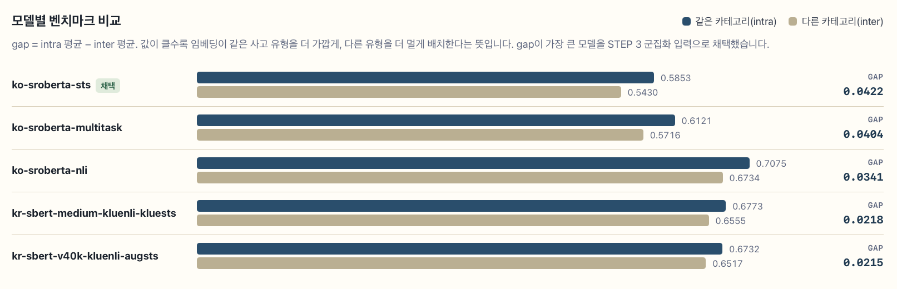

### 15.6 Embedding Space

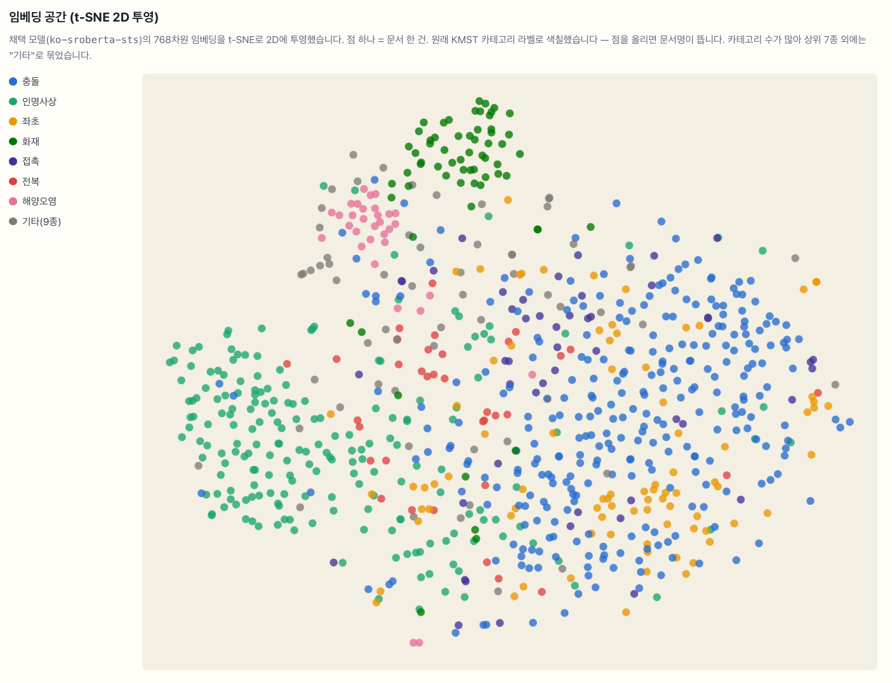

### 15.7 실제 유사도 쌍 예시 결과

<video src="./embedding_demo.mp4" controls width="800">
  브라우저가 영상 재생을 지원하지 않습니다.
</video>

## 16. STEP 3 : K-Means 군집화

> 이 장의 명령어는 **`step_3_process/` 안에서 실행**하는 것을 기준으로 합니다.

### 16.1 목적 및 산출물

STEP 2에서 채택된 임베딩(gap이 가장 큰 모델)으로 K-Means 군집화를 수행하고, Elbow와 Silhouette 두 지표를 함께 봐서 군집 개수(K)를 자동으로 정합니다.

각 군집은 Komoran 형태소 분석으로 뽑은 특징 키워드로 해석합니다. 선행 연구 대비 방법론 차이(Elbow만 vs Elbow+Silhouette)는 [Layer.md](Layer.md)의 "기준선" 절을 참고하세요.

### 16.2 환경 준비

Komoran 형태소 분석기(`konlpy`)는 Java 9 이상이 필요합니다 — 이 프로젝트 검증 환경엔 Java 8만 있어서 별도 설치가 필요했습니다.

```bash
sudo apt install -y openjdk-17-jdk
update-alternatives --config java   # 여러 버전이 있다면 17을 기본으로 선택

# STEP 2와 같은 venv를 재사용
source ../step_2_process/sbert_env/bin/activate
pip install konlpy wordcloud
```

### 16.3 실행

```bash
# 1) STEP 2 임베딩 인계 (이미 완료돼 있다면 생략 가능)
mkdir -p from_step2
cp ../step_2_process/embeddings/ko-sroberta-sts.bin ../step_2_process/embeddings/meta.csv from_step2/

# 2) K-Means + Elbow/Silhouette 자동 K탐색 (C++)
cd cpp && make && cd ..
./cpp/kmeans from_step2 output          # 기본 K=2~30 탐색, restarts=10

# 3) 군집별 특징 키워드 추출 (Komoran)
source ../step_2_process/sbert_env/bin/activate
python3 keywords.py

# 4) 워드클라우드 이미지 생성 (gui_web/assets/wordclouds/에도 자동 복사됨)
python3 wordcloud_gen.py

# 5) STEP 2의 2D 좌표에 군집 번호를 붙임 — gui_web 군집 산점도용
python3 join_tsne.py
```

### 16.4 출력 결과 설명

모두 `step_3_process/output/`에 쌓입니다.

| 파일                          | 내용                                                         |
| ----------------------------- | ------------------------------------------------------------ |
| `k_selection.csv`           | 탐색한 K별 WCSS·평균 Silhouette, Elbow/Silhouette/채택 여부 |
| `clusters.csv`              | 문서별 배정된 군집 번호                                      |
| `cluster_keywords.csv`      | 군집별 빈도 키워드 + 특징(distinctive) 키워드                |
| `wordcloud_cluster_<N>.png` | 군집별 워드클라우드 이미지                                   |
| `tsne_clusters.csv`         | STEP2 좌표 + 군집 번호(조인 결과)                            |

### 16.5 K-means 탐색 결과

- 5개가 합리적이라는 결론이 나옴
- 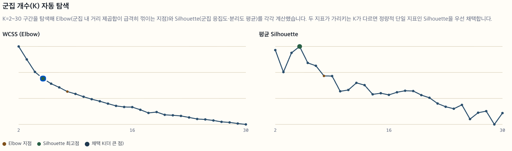

### 16.6 K-means 별 사고 인자

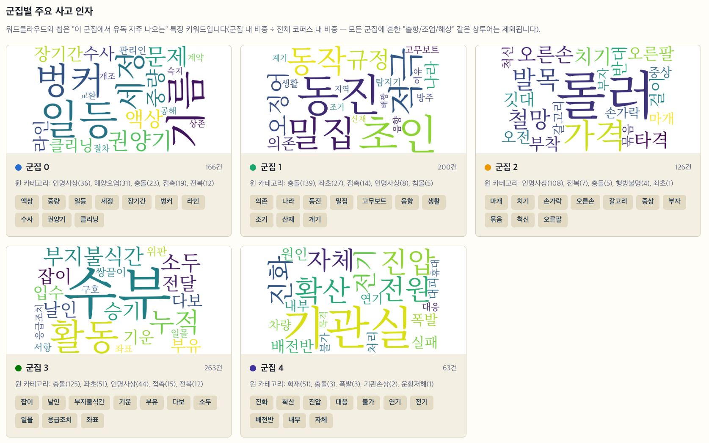

### 16.7 소결

군집별 주요 사고 인자 결과를 STEP 4(LLM 구조화 레이블링)로 넘기기 전에 정리한 소결입니다.

- **잘 분리된 군집**
  - 아래 군집은 특징 키워드의 편중도(군집 내 비중 ÷ 전체 비중)가 높아, 별도 규칙 없이도 임베딩만으로 사고 유형이 뚜렷하게 갈렸습니다.
    - 군집 4(63건) — 진화, 확산, 진압 중심으로 뚜렷이 분리됩니다뚜렷함
    - 군집 2(126건) — 마개, 치기, 손가락 중심으로 뚜렷이 분리됩니다뚜렷함

* **모호한 군집**

  * 반대로 아래 군집은 크기는 크지만(전체의 32.2%) 특징 키워드가 약해 "출항/조업/해상"처럼 여러 사고 유형에 공통되는 상투어 위주로 묶여 있습니다. 이 군집 내부에 서로 다른 사고 원인이 섞여 있을 가능성이 높습니다.
    * 군집 3(263건, 전체의 32.2%) — 특징 키워드 신호가 가장 약한 큰 덩어리입니다모호함
* **STEP 4로 넘길 때 고려할 점**

  * 전체 평균 Silhouette이 0.0473로 낮은 편인 것도 같은 신호입니다. 재결서 문장이 사고 유형과 무관하게 정형화된 표현을 광범위하게 공유하기 때문에, K-Means 같은 거리 기반 군집화만으로는 완전히 갈라지지 않습니다.
  * STEP 4(LLM 구조화 레이블링)에서는 이 결과를 그대로 정답으로 쓰기보다 아래 방향을 검토해볼 수 있습니다.
* 잘 분리된 군집(화재·신체부상 등)은 대표 문장을 시드로 그대로 활용하는 방향 고려
* 모호한 대형 군집은 LLM에게 한 번 더 세분화를 맡겨 사전 정의된 사고원인 체계로 재배치하는 방향 고려

---

## 17. STEP 4 : LLM 기반 사고원인 구조화 레이블링

STEP 3의 군집을 사전 정의된 사고원인 대분류로 레이블링합니다.

### 17.1 목적

군집별 특징 키워드와 대표 문장 일부를 LLM에 보내 "경계소홀/정비불량·기기결함/화재·폭발/…" 같은 사전 정의된 분류 후보 중 하나를 제안받고, 근거와 확신도를 함께 받습니다. STEP 3에서 818건 전체가 이미 군집에 배정돼 있으므로, 문서 단위로 LLM을 다시 호출하지 않고 군집 라벨을 그대로 조인해 전체를 분류합니다(gui_web STEP4 페이지의 "전체 818건에 적용" 버튼).

### 17.2 분기 1: OpenAI API

`config/config.php`에 키를 등록합니다.

```php
define('OPENAI_API_KEY', 'sk-...');       // https://platform.openai.com/api-keys
define('OPENAI_CHAT_MODEL', 'gpt-4o-mini');
```

이 키는 `gui_web/api_llm_label.php`(서버 사이드)에서만 쓰이고 브라우저로는 내려가지 않습니다. gui_web 통합 리포트(18장)의 STEP4 탭에서 "레이블링 실행" 버튼으로 호출합니다.

> 이 프로젝트 검증 환경엔 PHP `curl`/`mbstring` 확장이 없어서, `api_llm_label.php`는 `file_get_contents` + 스트림 컨텍스트, 그리고 직접 구현한 UTF-8 자르기 함수로 우회합니다. 두 확장이 있는 환경이라면 별도 조치 없이 그대로 동작합니다.

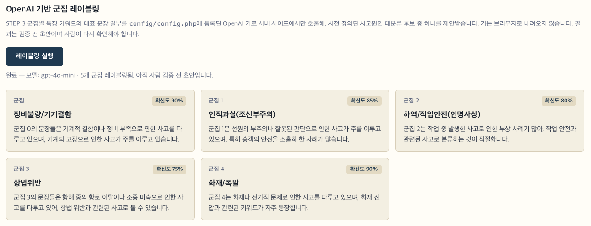

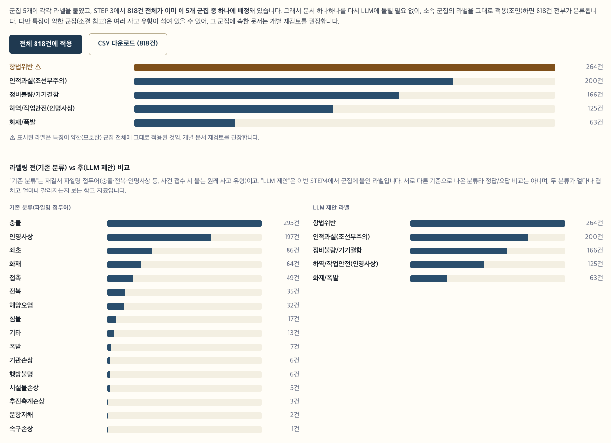

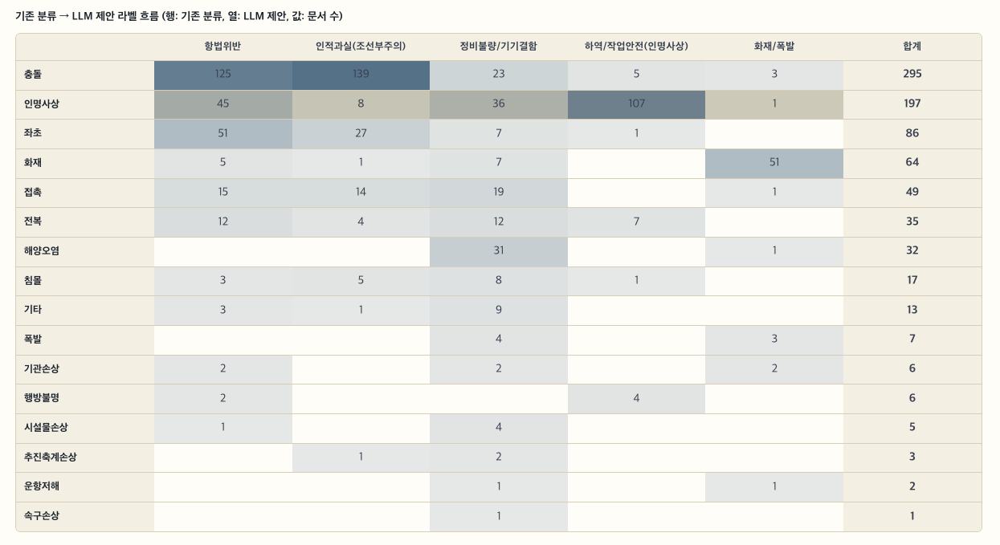

### 17.3 분기 2: DGX Spark 로컬 LLM

외부 API·인터넷 연결 없이, 이 기기(GPU)에 모델을 직접 올려 같은 작업을 수행하는 경로입니다. 여러 모델을 받아서 비교할 수 있도록 만들어져 있습니다.

```bash
cd step_4_process
source ../step_2_process/sbert_env/bin/activate
pip install fastapi "uvicorn[standard]" accelerate

python3 local_llm_server.py     # 기본 포트 8500
```

기본 비교 카탈로그(`local_llm_server.py`의 `MODEL_CATALOG`) — 크기 축(Qwen 3B/7B/14B)과 계열 축을 함께 봅니다. 계열 축은 크기 차이가 결과에 섞이지 않도록 가능한 한 7B 안팎으로 맞췄습니다.

| 모델                                     | 계열/크기    | 비고                                                       |
| ---------------------------------------- | ------------ | ---------------------------------------------------------- |
| `Qwen/Qwen2.5-3B-Instruct`             | Qwen, 소형   | 다운로드 빠름, 기본값                                      |
| `Qwen/Qwen2.5-7B-Instruct`             | Qwen, 중형   | 크기 축 비교 (Qwen 계열)                                   |
| `Qwen/Qwen2.5-14B-Instruct`            | Qwen, 대형   | 크기 축 비교 (Qwen 계열)                                   |
| `mistralai/Mistral-7B-Instruct-v0.3`   | Mistral, 7B  | 계열 축 비교                                               |
| `microsoft/Phi-3.5-mini-instruct`      | Phi, 3.8B    | 계열 축 비교 — 아래 참고                                  |
| `LGAI-EXAONE/EXAONE-3.5-7.8B-Instruct` | EXAONE, 7.8B | 계열 축 비교, 한국어 특화,**trust_remote_code 필요** |
| `meta-llama/Llama-3.1-8B-Instruct`     | Llama, 8B    | 계열 축 비교,**gated** — 아래 참고                  |

각 모델은 처음 요청이 올 때 자동으로 다운로드·로드됩니다(지연 로딩). 모델 가중치는 `~/.cache/huggingface/hub/`에 캐시되어 재실행 시 다시 받지 않습니다.

> Phi 계열은 원래 7B급(`microsoft/Phi-3-small-8k-instruct`)으로 맞추려 했으나, 이 환경의 transformers(5.14.1)에서 그 저장소의 커스텀 모델링 코드가 요구하는 패키지를 다 설치해도(`requests`/`tiktoken`/`einops`/`pytest`) 결국 `rope_scaling` 설정 파싱에서 `Field short_factor is required` 오류로 로드가 안 됐습니다 — 커스텀 코드와 이 transformers 버전 간 호환성 문제로 보입니다. 그래서 Phi는 transformers에 네이티브로 포함돼 안정적으로 도는 `Phi-3.5-mini-instruct`(3.8B)로 되돌렸습니다. 즉 계열 축에서 Phi만 다른 모델보다 작다는 점을 감안해서 비교하세요.
>
> EXAONE-3.5와 Llama는 저장소에 포함된 커스텀 모델링 코드를 실행해야 로드됩니다(`trust_remote_code=True`). 둘 다 제작사(LG AI Research, Meta)의 공식 저장소라 허용했지만, 카탈로그에 다른 저장소를 추가할 때는 이 옵션이 임의 코드 실행을 허용한다는 점을 감안해 출처를 확인하세요.

**gated 모델(Llama, Gemma 등) 접근하기**: Hugging Face 계정으로 해당 모델 페이지(예: `huggingface.co/meta-llama/Llama-3.1-8B-Instruct`)에서 라이선스에 동의하고, [huggingface.co/settings/tokens](https://huggingface.co/settings/tokens)에서 Read 토큰을 발급받은 뒤 `config/config.php`에 등록합니다.

```php
define('HF_TOKEN', 'hf_...');
```

`local_llm_server.py`가 시작할 때 이 값을 자동으로 읽어 환경변수로 세팅합니다. 라이선스 동의 없이 토큰만 있으면 그 모델만 로드 실패(`status: "error"`)로 표시되고 나머지 모델은 정상 동작합니다.

gui_web STEP4 탭의 "로컬 LLM(DGX Spark)" 패널에서: **① "작동 유무 확인"으로 서버 응답을 먼저 확인 → ② 레이블링 실행**. 서버가 꺼져 있으면 실행 버튼이 비활성 상태로 유지됩니다.

### `Qwen/Qwen2.5-3B-Instruct` 레이블링 결과

- 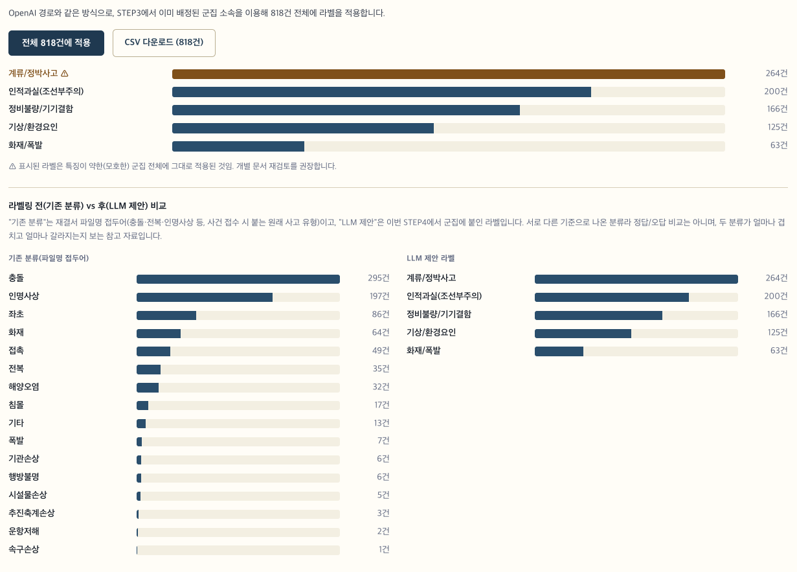
- 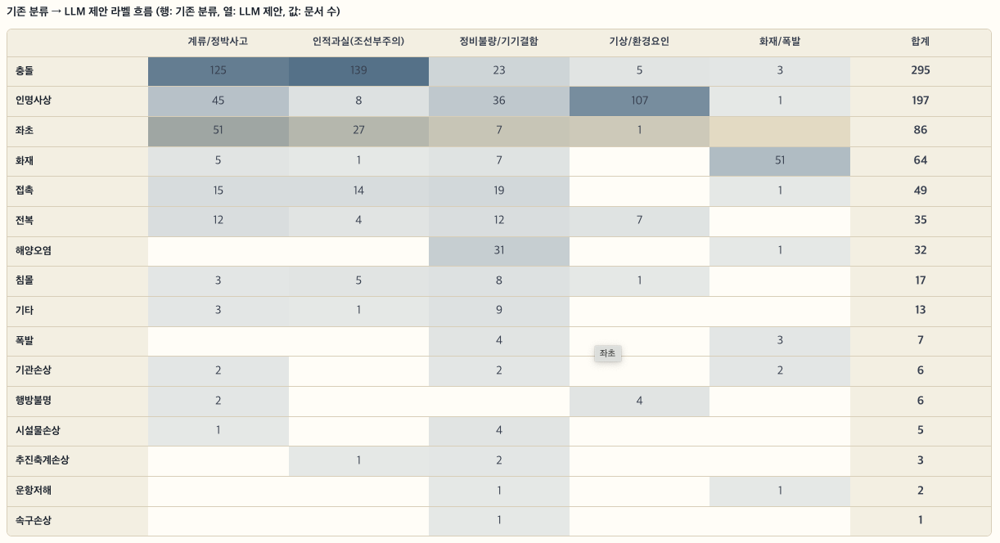


### 로컬 LLM 다중 모델 비교 결과


### 17.4 두 분기 비교 시 유의점

- 같은 프롬프트(군집 키워드 + 대표 문장 + 후보 라벨 목록)를 두 경로 모두에 그대로 씁니다(`gui_web/lib_llm_common.php`에 공용 구현) — 그래서 결과 차이는 순수하게 모델 성능 차이로 볼 수 있습니다.
- 실측 예시: 같은 군집을 gpt-4o-mini는 "하역/작업안전(인명사상)"으로, 로컬 Qwen2.5-3B는 "기상/환경요인"으로 다르게 판단한 사례가 있었습니다 — 모델·크기에 따라 판단이 갈릴 수 있다는 뜻이므로, 결과를 바로 확정 라벨로 쓰지 말고 사람이 검토하세요.
- 로컬 모델을 여러 개 동시에 로드하면 GPU 메모리를 그만큼 나눠 씁니다. 여유 메모리가 부족하면 특정 모델의 `/health`가 `status: "error"`로 뜰 수 있습니다.

---

## 18. 통합 리포트 (gui_web)

STEP 1~4 결과를 한 페이지에서 확인하는 웹 리포트입니다. `report_template.html` 하나를 정적 빌드(`generate_report.py`)와 실시간 서버(`report.php`)가 공유합니다.

### 18.1 정적 스냅샷 생성

```bash
cd gui_web
python3 generate_report.py    # STEP1(자체) + STEP2/3(모듈로 재사용) 데이터를 모아 report.html 생성
```

데이터를 다시 처리했다면(STEP 1~3 재실행) 이 스크립트를 다시 돌려야 `report.html`이 최신 상태로 갱신됩니다.

### 18.2 실시간 리포트(PHP) 실행

```bash
cd gui_web
php -S localhost:8000
```

브라우저에서 `http://localhost:8000/report.php` 접속. 재생성 스크립트를 따로 돌릴 필요 없이 요청마다 STEP1~3 산출물을 그 자리에서 다시 읽습니다(STEP4는 버튼을 눌러야 그때 API/로컬 LLM을 호출).

### 18.3 리포트 구성

상단 고정 메뉴바(펼치기/접기)로 STEP1~4 각 섹션의 하위 항목으로 바로 이동할 수 있습니다.

| STEP | 주요 구성                                                                                                |
| ---- | -------------------------------------------------------------------------------------------------------- |
| 1    | 처리 현황 통계, 필터·페이지네이션 가능한 문서별 표, 카테고리별 처리 현황 차트                           |
| 2    | 모델별 벤치마크 막대차트, t-SNE 임베딩 산점도, 유사도 쌍 예시, 3D 네트워크 시뮬레이션(드래그 회전·확대) |
| 3    | K 자동 탐색 곡선(Elbow/Silhouette), 군집 산점도, 군집별 워드클라우드·키워드, 소결                       |
| 4    | OpenAI/로컬 LLM 레이블링 실행, 결과 카드, 전체 818건 적용+CSV 다운로드                                   |

---

## 19. 운영 시 참고사항

### 19.1 파일 크기/페이지 수 제한

이 프로그램 코드 안에 하드코딩된 파일 크기 상한선이나 페이지 수 상한선은 없습니다. 다만,

- PaddleOCR로 넘길 페이지 수는 `PADDLE_OCR_MAX_PAGES`(기본 2)로 실질적으로 제한되어 있습니다(11장 참고).
- 파일이 매우 크거나 페이지가 아주 많으면 처리 시간이 길어지고 메모리 사용량이 늘어날 수 있습니다(정확한 한계치는 실측하지 않았습니다).

### 19.2 정확도에 영향을 주는 요인

- 원본 문서 레이아웃이 표준적인 재결요약서 양식과 다를수록(3단 이상 레이아웃, 복잡한 표 등) 정확도가 떨어질 수 있습니다. 2컬럼(좌측 라벨 + 우측 본문) 레이아웃과, 두 페이지가 나란히 스캔된 2단 PDF(`landscape_two_up`)는 PaddleOCR 경로에서 별도로 보정합니다(3.2절 참고).
- 스캔 품질이 낮은 PDF는 OCR 인식률이 낮아집니다.
- **OCRmyPDF(3단계, 보조 엔진)는 위 레이아웃 보정이 없습니다.** PaddleOCR 없이 OCRmyPDF만으로 2단 스캔 문서를 처리하면 "사고 경위"처럼 긴 문장이 뒤섞이거나 끊길 수 있으므로, 가능하면 PaddleOCR을 설치해서 쓰는 것을 권장합니다.
- `PADDLE_OCR_MAX_PAGES`(기본 2) 제한으로 3페이지 이상인 문서는 뒤쪽 내용이 OCR 대상에서 빠질 수 있습니다(11장 참고).

### 19.3 보안/개인정보

- OCR은 모두 **로컬(내 컴퓨터/서버 안)**에서만 처리되며, 외부 API로 문서를 전송하지 않습니다.
- 임시로 생성되는 파일(변환용 이미지, 임시 HWPX 등)은 처리가 끝나면 자동으로 삭제됩니다. 단, `KEEP_PDF_DEBUG=1`로 실행한 경우에는 디버깅 목적으로 `test_output/debug_pdf/`에 중간 결과가 남으므로, 민감한 문서를 이 옵션으로 처리했다면 확인 후 직접 삭제하세요.
- STEP 4의 OpenAI 경로만 예외입니다.
  - 군집 특징 키워드와 대표 문장 일부(원문 전체가 아님)가 OpenAI로 전송됩니다(17.2절).
  - DGX Spark 로컬 LLM 경로는 STEP 1과 마찬가지로 데이터가 외부로 나가지 않습니다.
- `config/config.php`에는 OpenAI API 키와 Hugging Face 토큰이 평문으로 저장됩니다. 이 파일을 공개 저장소에 커밋하거나 공유 호스팅에 그대로 올리지 마세요(18.4절 배포 참고).

---

## 20. 삭제 및 재설치

### 20.1 빌드 결과만 지우기

```bash
make clean
```

### 20.2 Python 패키지 제거

```bash
python3 -m pip uninstall paddleocr paddlepaddle
```

### 20.3 시스템 패키지 제거

```bash
# Linux
sudo apt remove ocrmypdf poppler-utils jq

# macOS
brew uninstall ocrmypdf poppler jq
```

### 20.4 재설치 순서

1. `make clean`으로 기존 빌드 정리
2. 5장(시스템 요구사항)부터 다시 설치
3. `make clean && make`로 재빌드
4. `bash ./run_test_data.sh`로 샘플 파일 검증

---

## 21. 부록

### 21.1 빠른 설치 명령 모음

**macOS**

```bash
xcode-select --install
brew install python poppler ocrmypdf jq
python3 -m pip install paddleocr paddlepaddle
make clean && make
```

**Linux (Ubuntu/Debian)**

```bash
sudo apt update
sudo apt install build-essential zlib1g-dev python3 python3-pip python3-venv \
  poppler-utils jq ocrmypdf
python3 -m pip install paddleocr paddlepaddle
make clean && make
```

### 21.2 빠른 실행 예시

```bash
./body_decoder ./sample.hwp auto
./body_decoder ./sample.hwpx auto
./body_decoder ./sample.pdf auto
혹은
bash ./step_1_run_decoder_data.sh
```

### 21.3 용어 풀이

| 용어                 | 쉬운 설명                                                                                                    |
| -------------------- | ------------------------------------------------------------------------------------------------------------ |
| HWP                  | 한글과컴퓨터의 옛 문서 형식(압축된 이진 파일)                                                                |
| HWPX                 | 한글과컴퓨터의 최신 문서 형식(XML 기반 압축 파일, 구조를 사람이 읽을 수 있음)                                |
| 네이티브 텍스트      | PDF/문서 안에 이미 저장돼 있는 진짜 글자 데이터(사진이 아니라 복사-붙여넣기가 되는 글자)                     |
| OCR (광학 문자 인식) | 사진/이미지 속 글자 모양을 컴퓨터가 인식해서 실제 텍스트로 바꿔주는 기술                                     |
| PaddleOCR            | 중국 바이두에서 만든 오픈소스 OCR 도구, 이 프로그램의 1차 OCR 엔진                                           |
| OCRmyPDF             | Tesseract OCR을 감싸서 PDF에 적용하기 쉽게 만든 도구, 이 프로그램의 2차(보조) OCR 엔진                       |
| Poppler              | PDF를 다루는 오픈소스 도구 모음(`pdftotext`, `pdftoppm` 등이 여기 포함)                                  |
| 정규화               | 텍스트에서 불필요한 기호/중복 공백 등을 정리해서 일관된 형태로 만드는 작업                                   |
| 키워드 4종           | 이 프로그램이 찾아내는 "사건 개요/일시/장소/사고 경위" 4가지 항목을 부르는 말                                |
| SBERT                | 문장 전체를 하나의 벡터(숫자 배열)로 바꿔서, 두 문장이 얼마나 비슷한 의미인지 계산할 수 있게 하는 모델(15장) |
| 임베딩               | 문장·단어를 컴퓨터가 계산할 수 있는 벡터로 바꾼 결과물                                                      |
| 코사인 유사도        | 두 벡터의 방향이 얼마나 비슷한지를 -1~1 숫자로 나타낸 값. 1에 가까울수록 의미가 비슷함                       |
| K-Means              | 비슷한 데이터끼리 K개의 그룹(군집)으로 자동으로 묶어주는 알고리즘(16장)                                      |
| Elbow / Silhouette   | K-Means에서 군집 개수(K)를 몇 개로 할지 자동으로 정하는 데 쓰는 두 가지 통계적 방법(16장)                    |
| 워드클라우드         | 자주 나오는 단어일수록 크게 그려서 한눈에 보여주는 시각화 방식                                               |
| LLM                  | ChatGPT처럼 사람 언어를 이해·생성하는 대형 언어모델. STEP 4에서 군집에 사고원인 라벨을 붙이는 데 사용(17장) |
| DGX Spark            | 이 프로그램이 개발·실행되고 있는 NVIDIA GB10 기반 로컬 GPU 서버. STEP 4의 "로컬 LLM" 경로가 여기서 돈다     |

### 21.4 버전 관리에 대해

이 프로젝트는 별도의 버전 번호 체계 없이 관리되고 있습니다.

문의하거나 이슈를 공유할 때는 아래 21.5의 정보와 함께, 어떤 시점의 코드인지(예: 마지막으로 받은 날짜)를 함께 알려주세요.

- `Email` : jiwoo93@kookmin.ac.kr

### 21.5 문제를 보고할 때 함께 제공하면 좋은 정보

- 운영체제와 CPU 종류 (예: Ubuntu 24.04 / macOS 14 Apple Silicon)
- 컴파일러 버전(`c++ --version`), Python 버전(`python3 --version`)
- 실행한 정확한 명령어
- 화면에 나온 오류 메시지 전체
- 처리하려던 파일의 형식(hwp/hwpx/pdf)과, 가능하다면 그 파일 자체
- 어떤 결과를 기대했는데 무엇이 다르게 나왔는지
