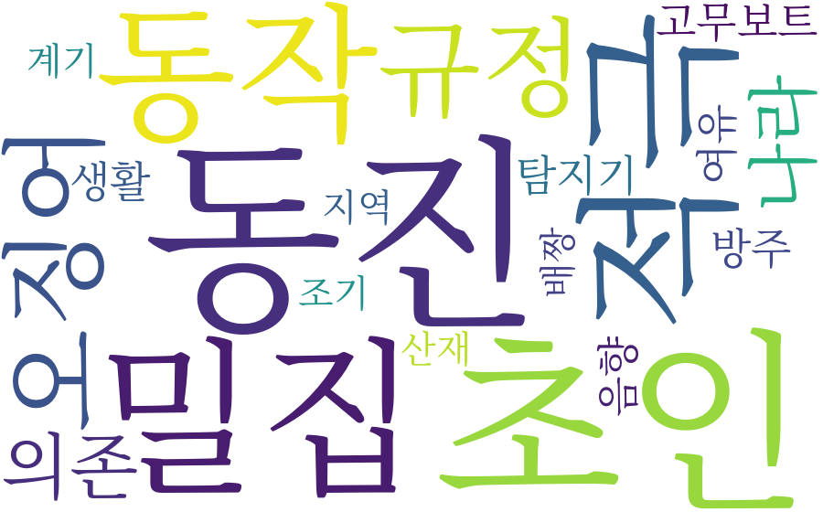
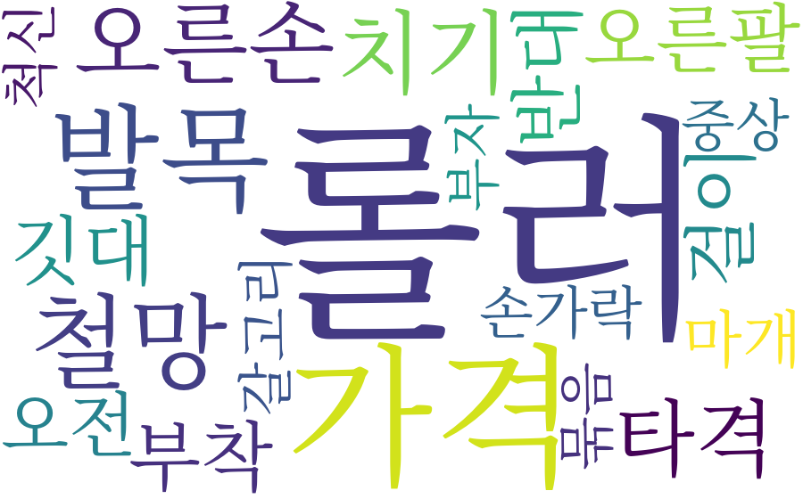

# STEP 별 설계 원칙

STEP 1과 STEP 2는 동일한 기술 선택 원칙을 따릅니다.

> 바이너리 구조 해석과 결정론적·반복적인 수치 계산은 C++로 처리하고, OCR 및 신경망 추론은 검증된 Python 생태계를 활용합니다.

언어를 하나로 통일하기보다 작업 특성에 맞는 도구를 선택하여 성능, 정확성, 재사용성, 구현 안정성을 확보하는 구조입니다.

---

## STEP 1. 문서 파싱 및 데이터 추출

### baseline

자동화 이전에는 사람이 재결요약서를 육안으로 읽고 4개 필드를 직접 옮겨 적어야 했습니다. 이 단계의 목표는 그 수작업을 자동 파싱으로 대체하는 것입니다.

### 목표

HWP, HWPX, PDF 문서에서 다음 4개 필드를 추출합니다.

- 사건개요
- 일시
- 장소
- 사고경위

### C++을 사용한 근거

1. 구조적·저수준 파싱에 적합

HWP와 HWPX는 단순 텍스트 파일이 아니므로 내부 구조를 해석해야 합니다.

- HWP: CFBF/OLE2 기반 바이너리 컨테이너
- HWPX: ZIP 기반 XML 문서

따라서 압축 해제, 바이너리 레코드 분석, 바이트 단위 데이터 처리 등이 필요합니다. 이러한 저수준 구조 파싱은 C++에 적합합니다.

2. 대량 문서의 반복 처리 성능

실제 코퍼스 818건 중 620건이 약 3~5ms 수준에서 처리되었습니다. 개발 과정에서는 전체 문서를 여러 번 재처리해야 하므로, 단건 성능뿐 아니라 반복 실험 속도도 중요했습니다.

C++의 빠른 처리 속도는 전체 데이터셋을 반복 검증하고 파싱 규칙을 개선하는 개발 흐름을 가능하게 했습니다.

3. 핵심 추출 로직의 단일 구현과 재사용

4개 필드를 판별하는 핵심 알고리즘은 C++에 한 번만 구현했습니다. 이 로직은 다음 경로에서 공통으로 사용됩니다.

- HWP 네이티브 파싱
- HWPX 네이티브 파싱
- PDF 텍스트 처리

PDF에서 추출된 텍스트도 가상 HWPX 형태로 포장한 후 동일한 C++ 디코더에 입력합니다. 이를 통해 복잡한 필드 추출 로직을 Python에 다시 구현하지 않고 일관된 결과를 유지합니다.

4. OCR과 PDF 관련 ML 처리는 Python 사용

STEP 1에서 모든 처리를 C++로 구현한 것은 아닙니다.

PaddleOCR, OCRmyPDF 등 OCR 및 ML 도구는 Python 생태계에서 제공되고 검증되어 있으므로 해당 영역은 Python으로 처리했습니다.

### STEP 1 역할 분담

| 영역               | 사용 언어  | 선택 이유                                |
| ------------------ | ---------- | ---------------------------------------- |
| HWP/HWPX 구조 파싱 | `C++`    | 바이너리·압축·레코드 구조 해석         |
| 4개 필드 추출      | `C++`    | 결정론적 핵심 로직의 단일 구현 및 재사용 |
| 반복 문서 처리     | `C++`    | 818건 전체 재처리에 필요한 성능 확보     |
| PDF 텍스트 후처리  | `C++`    | 기존 필드 추출 로직 재사용               |
| OCR 및 ML 추론     | `Python` | PaddleOCR·OCRmyPDF 등 검증된 도구 활용  |

---

## STEP 2. 임베딩 생성 및 모델 비교

### baseline

선행 연구(윤보리 외, 2023)는 KorSTS로 파인튜닝한 SBERT 모델 하나만 사용했습니다. 본 연구는 그 선택을 그대로 따르지 않고 5개 모델을 직접 벤치마크해 재검증합니다.

### 목표

STEP 1에서 생성한 818건의 데이터에 대해 5개 SBERT 계열 모델로 임베딩을 생성하고, 모델별 유사도 성능을 정량적으로 비교합니다.

전체 처리 흐름은 다음과 같습니다.

```text
step1_dataset.jsonl
        ↓
Python: 5개 모델로 문장 임베딩 생성
        ↓
모델별 float32 바이너리 + 메타데이터
        ↓
C++: 코사인 유사도 및 페어와이즈 행렬 계산
        ↓
모델별 벤치마크 집계
        ↓
CSV / JSON / 텍스트 리포트
```

### 1. Python 담당 영역: 임베딩 생성

Python은 신경망 모델을 실행하고 임베딩 벡터를 생성하는 역할만 담당합니다.

#### Python을 사용하는 근거

1. 모델의 공식 실행 환경

대상 모델 5개는 모두 Hugging Face의 `sentence-transformers`를 기준으로 배포·검증되었습니다.

- `jhgan/ko-sroberta-*`
- `snunlp/KR-SBERT-*`

모델 카드에서 제시하는 공식 사용 경로가 Python이므로, 이를 그대로 사용하는 것이 모델 제작자의 구현 의도를 가장 정확하게 보존합니다.

2. 검증된 신경망 추론 스택 활용

SBERT 추론에는 다음과 같은 복잡한 연산이 포함됩니다.

- 토크나이징
- 어텐션
- 레이어 정규화
- 텐서 연산
- Mean pooling
- GPU 추론

이를 직접 구현하지 않고 PyTorch와 `sentence-transformers`의 검증된 구현을 사용합니다. 준비 단계에서 `torch==2.13.0+cu130`을 통해 GB10 GPU 인식도 확인했으므로 기존 환경을 그대로 활용할 수 있습니다.

3. STEP 1의 기술 원칙과 일관성 유지

STEP 1에서도 PaddleOCR와 같은 ML 추론은 Python으로 처리했습니다. SBERT 역시 신경망 추론에 해당하므로 동일하게 “ML 추론은 Python”이라는 원칙을 적용합니다.

4. 재구현에 따른 정확도 위험 방지

토크나이저, 임베딩 풀링, 마스킹 등을 C++로 재구현하면 공식 구현과 미세하게 다른 결과가 발생할 수 있습니다. `sentence-transformers`를 그대로 사용하면 이러한 구현 차이와 검증 부담을 방지할 수 있습니다.

#### Python의 처리 범위

```text
step1_dataset.jsonl 818건 읽기
→ embedding_text 추출
→ 5개 모델로 각각 인코딩
→ 문서별 768차원 임베딩 생성
→ 모델별 float32 바이너리 파일 저장
```

Python에서는 임베딩 생성까지만 수행하며, 코사인 유사도나 모델 벤치마크 계산은 수행하지 않습니다.

---

### 2. C++ 담당 영역: 유사도 계산 및 벤치마크

C++은 Python이 생성한 임베딩을 읽어 결정론적 수치 계산과 정량 평가를 수행합니다.

| 담당 기능              | C++을 사용하는 이유                               |
| ---------------------- | ------------------------------------------------- |
| 코사인 유사도 계산     | 내적과 노름으로 구성된 순수 수치 연산             |
| 페어와이즈 유사도 행렬 | 대량 반복 계산에서 낮은 오버헤드와 높은 성능 확보 |
| 모델 간 벤치마크 집계  | 동일한 평가 기준을 결정론적으로 적용              |
| 상위·하위 유사쌍 추출 | 정렬과 반복 비교를 효율적으로 수행                |
| 결과 출력              | CSV·JSON·텍스트 형식의 정량 리포트 생성         |

818개 문서의 전체 조합은 모델당 약 33만 쌍입니다.

```text
818 × 817 ÷ 2 = 334,153쌍
```

5개 모델을 모두 평가하면 약 167만 쌍을 계산합니다.

```text
334,153 × 5 = 1,670,765쌍
```

각 쌍마다 768차원 벡터의 내적과 노름 계산이 필요하므로, 반복문 기반 Python 코드보다 C++에서 처리하는 것이 전체 벤치마크에 유리합니다.

### 모델별 평가 항목

C++ 벤치마크에서는 다음 지표를 산출합니다.

- 동일 카테고리 내부 평균 유사도
- 서로 다른 카테고리 간 평균 유사도
- 내부·외부 유사도의 차이 또는 분리도
- 유사도 표준편차
- 상위 유사 문서 쌍
- 하위 유사 문서 쌍
- 모델별 종합 비교 결과

## 모델 벤치마크

818건, 16개 카테고리, 카테고리 내부(intra) 쌍 70,888개 / 카테고리 외부(inter) 쌍 263,265개(총 334,153쌍) 기준. `gap = intra 평균 - inter 평균`이 클수록 임베딩이 카테고리를 잘 분리한다는 뜻입니다.

| 모델                            | intra 평균 | inter 평균 | gap              |
| ------------------------------- | ---------- | ---------- | ---------------- |
| **ko-sroberta-sts**       | 0.5853     | 0.5430     | **0.0422** |
| ko-sroberta-multitask           | 0.6121     | 0.5716     | 0.0404           |
| ko-sroberta-nli                 | 0.7075     | 0.6734     | 0.0341           |
| kr-sbert-medium-klueNLI-klueSTS | 0.6773     | 0.6555     | 0.0218           |
| kr-sbert-v40k-klueNLI-augSTS    | 0.6732     | 0.6517     | 0.0215           |

- `ko-sroberta-sts` : [huggingface.co/jhgan/ko-sroberta-sts](https://huggingface.co/jhgan/ko-sroberta-sts)


gap이 가장 큰 `ko-sroberta-sts`(KorSTS 단독 학습 모델)를 STEP 3의 군집화 입력으로 채택합니다. KLUE-STS 계열 2종은 이 데이터셋에서는 오히려 gap이 가장 낮았습니다. 전체 결과는 `step_2_process/embeddings/benchmark_results.csv`에 저장되어 있습니다.

문서 쌍 하나하나의 실제 유사도 값(논문 3.2절의 "두 재결서 사이의 의미적 유사도를 정량적으로 출력"에 해당하는 원 자료)은 집계 과정에서 버리지 않고, 모델별 상위/하위 50쌍을 `<모델명>_top_pairs.csv` / `<모델명>_bottom_pairs.csv`로 남깁니다. `ko-sroberta-sts` 기준 최상위 유사 쌍 중 유사도 1.0000에 가까운 사례들은 서로 다른 파일로 등록되어 있지만 내용이 사실상 동일한 재결서(예: 파일명 끝에 `_1`이 붙은 중복 등록)로 확인되어, STEP 1 데이터 정합성 점검 시 참고할 만합니다.

---

# STEP 3. K-Means 군집화 및 군집별 주요 사고 인자 도출 (설계)

> STEP 1, STEP 2가 완료된 뒤 진행합니다.
> 아래는 구현 전 설계이며, 근거는 이 연구가 참고·확장하는 선행 연구인 다음 논문의 프레임워크를 따릅니다.
>
> 윤보리, 박세길, 배혜림, 심성현(2023), "SentenceBERT 모델을 활용한 해양안전심판 재결서 분석 방법에 대한 연구", 한국해양환경·에너지학회지, 29(7), 843-856.

### baseline

선행 연구는 Elbow Method만으로 K=10을 결정했습니다. 본 연구는 Elbow+Silhouette을 함께 사용해 자동으로 K를 채택합니다(실행 결과 K=5) — 군집 수 자체가 선행 연구와 다르므로, 해석은 선행 연구의 10개 군집과 직접 비교하기보다 독립적으로 검증합니다.

### 목표

STEP 2에서 생성한 SBERT 임베딩을 K-Means로 군집화하고, 각 군집에서 두드러지는 사고 원인 키워드를 도출합니다. 원 논문은 이 결과를 워드클라우드로 시각화해 군집별 사고 유형(경계 소홀, 정박 중 충돌, 기기 결함 등)을 해석했습니다.

### 사용 임베딩 모델

STEP 2 벤치마크에서 gap이 가장 컸던 `ko-sroberta-sts` 임베딩을 그대로 사용합니다. 원 논문 3.2절도 "SBERT 모델은 한국어 문장 간의 유사도가 표시된 KorSTS 데이터셋을 학습에 사용"한다고 명시하고 있어, 원 논문의 설계 방침과 본 연구의 실증 결과가 일치합니다.

### K-Means를 선택하는 근거

원 논문 2.3절은 K-Means가 "대규모 데이터셋에 대해서도 빠르고 효과적인 성능을 보이는 장점"이 있고(Soni and Ganatra, 2012), "다른 군집화 방법과 비교하였을 때 계산 복잡성이 낮고 직관적인 결과를 제공"한다고 인용합니다(Kodinariya and Makwana, 2013). 본 연구도 동일한 이유로 K-Means를 채택합니다.

### 군집 개수(K) 결정 방법: Elbow + Silhouette 병행

원 논문은 군집 내 거리 제곱합(WCSS)의 감소율이 급격히 꺾이는 지점을 K로 정하는 Elbow Method만 사용해 K=10을 결정했습니다. 다만 "감소율의 변화가 일정해지면 사용자의 판단으로 군집 수가 결정된다"고 밝히듯, Elbow는 최종적으로 사람이 그래프를 보고 판단해야 하는 모호함이 남습니다.

원 논문이 함께 인용한 근거에 따르면 "군집의 수를 과다하게 설정하면 과적합의 위험이 있고, 반대로 너무 적게 설정하면 군집화의 효과가 줄어들 수 있다. 이를 해결하기 위해 Elbow Method, Silhouette Analysis 등 다양한 방법들이 사용되어 최적의 군집 수를 찾을 수 있다"(Ashari et al., 2023)고 명시되어 있습니다. 본 연구는 이 근거에 따라 Elbow와 Silhouette 두 지표를 함께 사용해 K를 자동으로 탐색합니다.

- **Elbow**: 후보 K 범위를 반복하며 WCSS(군집 내 거리 제곱합)를 계산하고, 감소율이 가장 크게 꺾이는 지점을 후보 K로 삼습니다.
- **Silhouette**: 각 후보 K에 대해 실루엣 계수(군집 내 응집도 대비 군집 간 분리도, -1~1 범위)의 평균을 계산하고, 평균 실루엣 점수가 가장 높은 K를 후보로 삼습니다.
- 두 방법의 후보 K가 일치하면 그대로 채택하고, 불일치하면 정량적 단일 지표인 실루엣 점수를 우선하되 두 지표를 모두 리포트에 남겨 판단 근거를 투명하게 유지합니다.

## 군집화 결과

아래 워드클라우드는 빈도가 아니라 **특징 키워드**(군집 내 비중 ÷ 전체 코퍼스 내 비중)로 그렸습니다. 단순 빈도로 그리면 "출항·조업·해상"처럼 모든 군집에 공통되는 상투어만 커지기 때문에, 그 군집에서 유독 자주 나오는 단어만 크게 보이도록 했습니다(`step_3_process/wordcloud_gen.py`).

#### 군집 0 — 화물·예인/계류 작업 관련 (166건, 전체의 20.3%)


원 STEP1 카테고리로는 충돌·인명사상·접촉이 섞여 있지만, 특징 키워드는 `액상·중량·벙커·권양기·클리닝·세정` 등 화물 적재 상태와 예인·계류 작업에 관련된 단어가 두드러집니다.

#### 군집 1 — 항해 중 충돌·발견 지연 (200건, 전체의 24.4%)



원 카테고리 상위는 충돌·좌초·접촉입니다. 특징 키워드(`밀집·음향·조기·계기` 등)는 항해 중 다른 선박을 늦게 발견하거나 신호를 놓친 정황과 관련된 단어 위주입니다.

#### 군집 2 — 어구·롤러 작업 중 신체 부상 (126건, 전체의 15.4%)



`마개·손가락·오른손·갈고리·중상` 등 신체 부위·부상 관련 단어가 뚜렷합니다. 원 카테고리(인명사상·전복·충돌)와 함께 보면, 조업 중 어구나 롤러에 신체가 끼여 다치는 유형의 사고로 해석됩니다. 특징 키워드 편중도(score)가 5개 군집 중 두 번째로 높아(7.27) 잘 분리된 군집입니다.

#### 군집 3 — 특징이 약한 대형 혼합 군집 (263건, 전체의 32.2%)


전체 문서의 3분의 1을 차지하는 가장 큰 군집이지만, 특징 키워드 편중도(score 2.85)가 5개 군집 중 가장 낮습니다. `잡이·날인·부지불식간·좌표` 등 특정 사고 유형 하나로 수렴하지 않는 잡다한 단어들이 섞여 있어, 서로 다른 사고 원인이 이 군집 안에 뒤섞여 있을 가능성이 큽니다 — STEP 4에서 우선적으로 세분화를 검토할 대상입니다.

참고로 군집 4(화재, 63건)는 `진화·확산·진압·배전반` 등으로 5개 군집 중 특징이 가장 뚜렷합니다(score 12.98) — 이미지는 `step_3_process/output/wordcloud_cluster_4.png`에 있습니다.

### 언어 분담

| 영역                                        | 사용 언어  | 선택 이유                                                                 |
| ------------------------------------------- | ---------- | ------------------------------------------------------------------------- |
| K-Means 반복 연산(centroid 갱신, 거리 계산) | `C++`    | STEP 2와 동일하게 결정론적·반복적 수치 계산                              |
| WCSS/Elbow 계산                             | `C++`    | K-Means 결과에서 파생되는 순수 수치 집계                                  |
| Silhouette 계수 계산                        | `C++`    | 페어와이즈 거리 기반 반복 계산 — STEP 2 코사인 유사도 계산과 동일한 성격 |
| 군집별 주요 키워드 도출                     | `Python` | 한국어 형태소 분석(Komoran 등) — 원 논문도 Komoran 사용                  |
| 워드클라우드/시각화                         | `Python` | 검증된 시각화 생태계(wordcloud, matplotlib 등) 활용                       |

STEP 1, STEP 2에서 이미 적용한 원칙 — "구조적·결정론적 반복 계산은 C++, 검증된 ML/NLP 생태계가 필요한 영역은 Python" — 을 STEP 3에도 동일하게 적용합니다.

---

# STEP 4. 페르소나 체인 기반 군집 레이블링 (`step4/`)

> 실험 단계. STEP 3에서 나온 군집을 대상으로, "역할·정체성을 부여한 LLM(페르소나)이 정체성 없는 동일 LLM보다 레이블링 품질에 실제로 도움이 되는가"를 정량 검증합니다.

### baseline

이전 버전은 군집 키워드+대표 문장을 프롬프트 A/B/C 변형과 여러 모델(OpenAI API·로컬 다중 모델)에 그대로 던져 라벨 하나를 받고, 같은 조합을 반복 실행해 "얼마나 자주 같은 라벨이 나오는가(안정도)"만 측정했습니다. 프롬프트 문구를 바꿔가며 비교했을 뿐, "역할을 부여하는 것 자체가 효과가 있는가"라는 질문에는 답하지 않았습니다.

본 버전은 프롬프트 변형 비교 대신 **정체성 유무 대응비교(ablation)**로 질문을 바꾸고, 단일 판단 대신 **사실 추출 → 원인 검증 → 레이블 확정**의 3단계로 작업을 쪼갠 페르소나 체인을 도입했습니다. 외부 API 비교는 이번 범위에서 제외하고 로컬 모델 하나로 좁혔습니다 — 비교축이 "모델·프롬프트 종류"에서 "정체성 유무"로 바뀌었기 때문에, 모델 자체를 여러 개 두는 것은 더 이상 이 질문에 필요하지 않습니다.

### 목표

군집 5개 각각에 대해 **정체성 포함(identity_on) / 정체성 제거(identity_off)** 두 조건으로, 동일한 3단계 체인을 실행해 KMST(해양안전심판원) 공식 사고원인 분류체계 기준 최종 레이블을 산출하고, 두 조건의 차이를 통계로 비교합니다.

### 왜 순차 체인인가 (단일 판단이 아니라 3단계로 쪼갬)

페르소나를 원래 만들 때 쓴 설계 문서 자체가 "세 페르소나는 독립된 역할을 가지며 다음 순서로 실행한다"고 명시했고, 각 단계의 입력 계약이 실제로 앞 단계 출력을 요구합니다 — 원인 검증 단계는 사실 추출 단계가 만든 사실·증거 ID를 참조해야 하고, 레이블 확정 단계는 원인 검증 단계가 확정한 원인 ID를 참조해야 합니다. 즉 "역할이 독립적"이라는 말은 세 역할이 서로 겹치지 않는다는 뜻이지, 순서 없이 병렬로 돌려도 된다는 뜻이 아닙니다. 사실 확인과 원인 판단을 한 번에 시키면 확인 안 된 내용을 사실처럼 단정하는 문제가 생기기 쉬워, 단계를 쪼개 각 단계가 한 가지 판단에만 집중하도록 했습니다.

### 왜 "정체성만 제거한 대응쌍"을 정규식이 아니라 마커로 만드는가

프롬프트에서 정체성 문구("당신은 KMST-P0N ~이다")를 정규식으로 추측해 지우면, 의도치 않게 다른 문구까지 같이 바뀔 위험이 있고 그걸 검증할 방법이 없습니다. 대신 정체성 문장을 명시적 마커로 감싸두고, 마커 안쪽만 기계적으로 포함/제외해 두 버전을 만든 뒤, "마커 바깥 내용이 한 글자도 안 바뀌었는지"를 코드로 직접 검증(diff)합니다. 이 검증이 실패하면 실행 자체를 중단합니다 — 비교의 유일한 변수가 정체성 유무라는 것을 사람이 눈으로 확인하는 대신 자동으로 보증하기 위함입니다.

### 왜 재현 가능한(greedy) 디코딩을 쓰는가, 그리고 그 대가

온도(temperature)를 0으로 고정해 "같은 입력이면 같은 출력"을 원칙으로 삼았습니다. 반복 실행 기반 안정도 지표(구버전의 핵심 지표) 대신, 조건당 1회만 실행하고 그 결과를 신뢰할 수 있는지는 별도로 "동일 입력을 정말로 두 번 실행해서 바이트 단위로 같은 결과가 나오는가"를 직접 검사하는 방식으로 대체했습니다.

실제로 이 검사에서 **같은 입력·같은 온도 0인데도 재현이 안 되는 사례**를 실측했습니다. 원인은 두 가지였습니다.

1. 추론 엔진이 여러 요청을 한 배치로 묶어 처리할 때, 배치 구성에 따라 부동소수점 연산 순서가 달라질 수 있음 — 군집 5개를 한 번에 배치로 묶는 대신 하나씩 순차 처리하도록 바꿔서 배치 구성 자체를 항상 동일하게 고정했습니다.
2. 캐시 재사용 여부가 호출 순서에 따라 달라질 수 있음 — 캐시 재사용 기능을 꺼서 없앴습니다.

### 왜 후보 레이블 목록을 프롬프트에 직접 넣어야 했는가

레이블을 확정하는 마지막 단계의 출력 규격에 "label_code는 문자열"이라고만 정의돼 있고 실제 후보 목록이 없으면, 모델이 KMST 공식 분류체계와 무관한 값을 스스로 지어냅니다(실측: `DC-001`, `TF_ENGINE_FAILURE` 같은 존재하지 않는 코드). 이 문제를 프롬프트에 KMST 공식 대분류·세부항목 22종을 직접 나열해 주는 방식으로 해결했고, 실제로 나온 값이 그 목록 안에 있는지도 별도로 검증해 지표로 남깁니다.

### 왜 반복 생성을 억제하는 장치가 따로 필요했는가

군집 하나에 서로 다른 사건에서 뽑은 대표 문장이 최대 15개까지 들어가다 보니, 사실·증거를 교차 인용하는 과정에서 모델이 존재하지 않는 항목 번호를 계속 늘려가며 나열하는 반복 생성에 빠지는 사례가 실측됐습니다. 온도 0(greedy) 디코딩은 한 번 이런 패턴에 들어가면 다음 토큰도 항상 "패턴을 잇는 것"이 확률 1위가 되어 스스로 못 빠져나오는 구조적 약점이 있습니다(무작위성이 있는 샘플링과 달리 우연히 다른 토큰이 뽑혀 패턴이 깨질 여지가 없음). 이를 프롬프트에 "인용 개수 상한을 명시"하는 방법과, 이미 나온 횟수에 비례해 페널티를 누적하는 디코딩 옵션을 함께 적용해 억제합니다.

### 모듈 구성 (`step4/`)

STEP 1~3처럼 C++/Python으로 언어를 나누지는 않습니다 — STEP4는 LLM 호출 오케스트레이션과 통계 처리가 중심이라 전체를 Python으로 구현했고, 실제 대량 수치 연산(추론 자체)은 로컬 LLM 실행 엔진(GPU 추론)이 담당합니다. 대신 역할을 모듈 단위로 분리했습니다.

| 책임 | 역할 |
| --- | --- |
| 자산 검증 | 페르소나 정의·법령 코퍼스·군집 산출물이 전부 있는지 확인, 누락 시 조용히 넘어가지 않고 실행 중단 |
| 정체성 대응쌍 생성·검증 | 마커 기반으로 identity_on/off 프롬프트를 만들고 차이가 정체성 문구뿐인지 자동 검증 |
| 군집 입력 조립 | STEP3 군집 결과·키워드와 STEP2 원문 텍스트를 모아 군집별 프롬프트 재료로 구성 |
| 체인 오케스트레이션 | 군집×조건마다 3단계를 순서대로 실행하고, 이미 끝난 조합은 재실행 시 건너뜀(중단 후 재개 가능) |
| 로컬 추론 실행 | 생성 파라미터(온도·반복 억제 등)를 코드에 하드코딩하지 않고 전부 설정값에서 읽어 적용 |
| 출력 검증 | 응답을 JSON으로 해석하고 정해진 규격(필수 필드·값 종류)을 만족하는지 확인, 실패는 그대로 실패로 기록 |
| 정량 비교·리포트 | 정체성 유무 간 레이블 변화율·통계적 유의성·재현성을 계산해 최종 리포트로 정리 |
