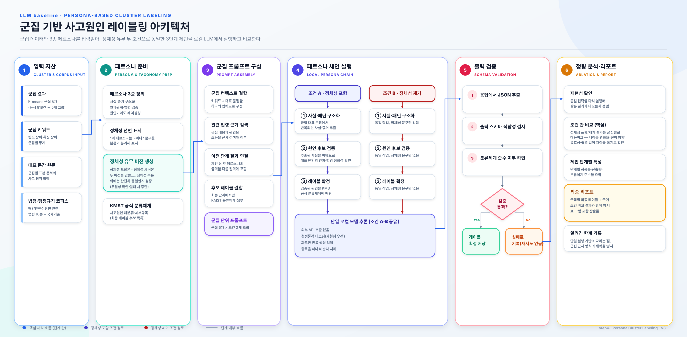
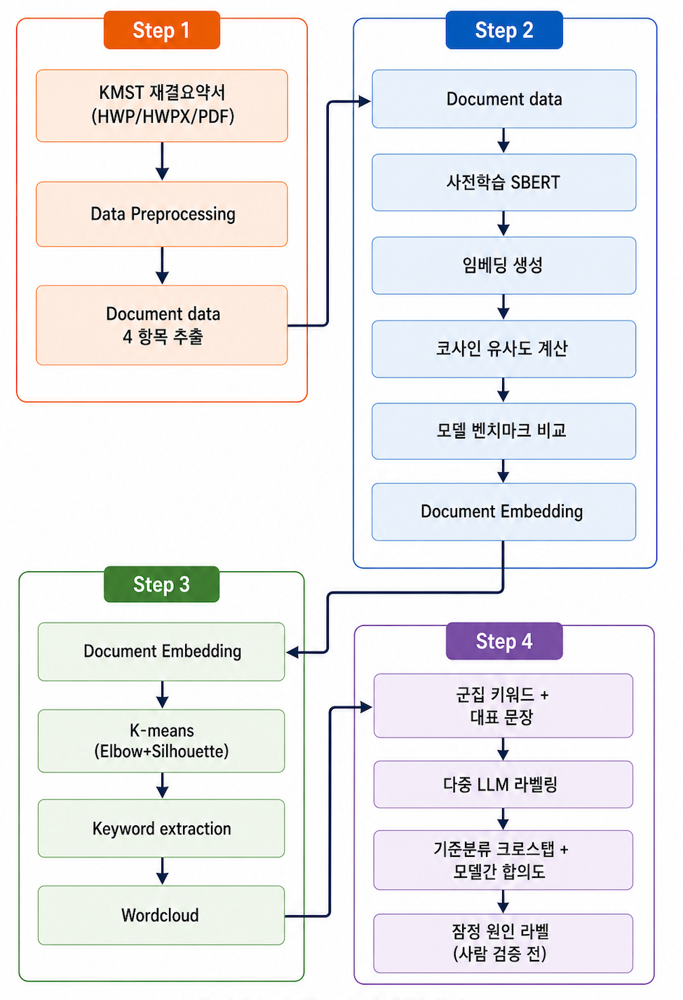
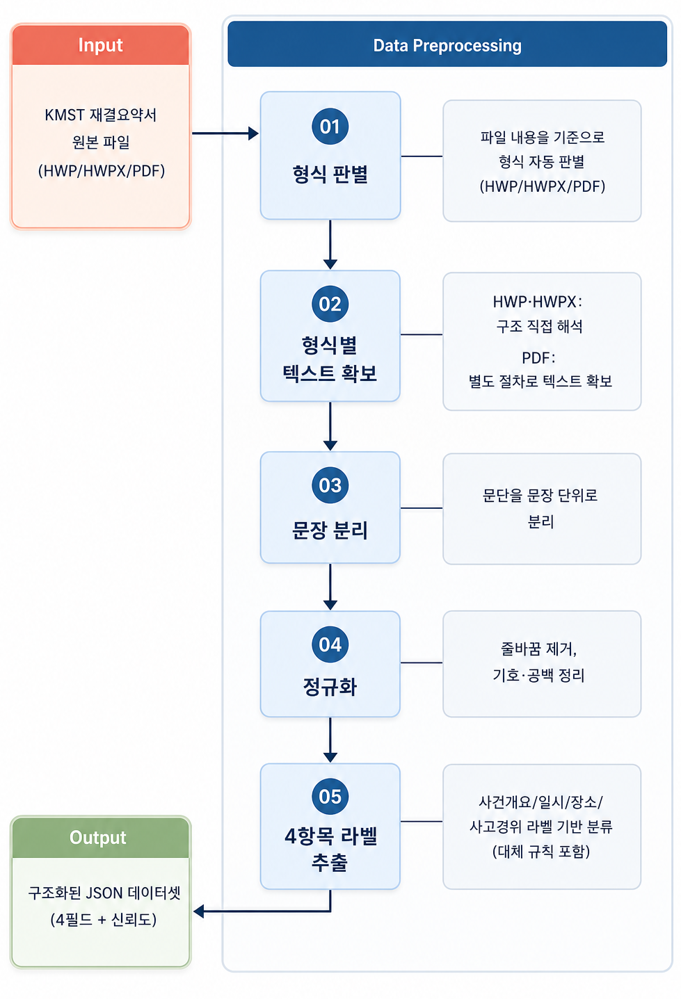
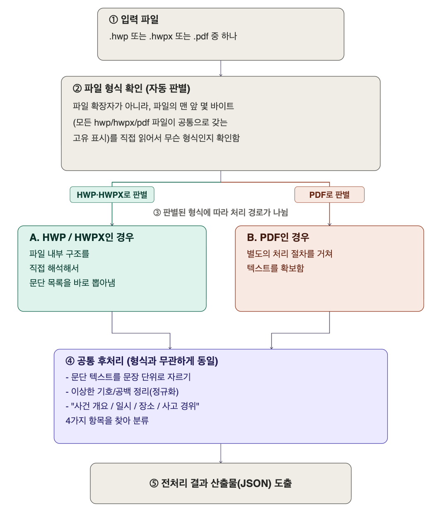
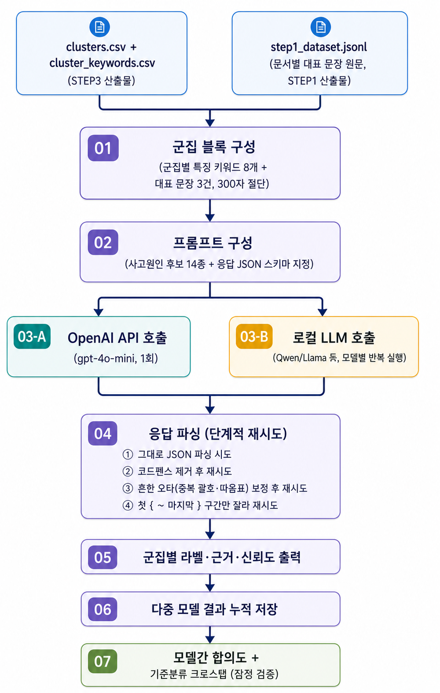

# LLM 기반 해양사고 원인 분류체계 구축 연구

한국해양안전심판원(KMST) 재결요약서(`.hwp`/`.hwpx`/`PDF`)를 입력받아 텍스트를 추출하고, SBERT 임베딩 유사도 정량화·K-Means 군집화를 거쳐 LLM 기반 사고원인 구조화 라벨링까지 이어지는 4단계 파이프라인입니다.

```
STEP 1  전처리                 문서 → 문단 추출 → 문장 정리 → 4대 항목 파싱 → JSON
STEP 2  SBERT 유사도 정량화     5개 한국어 SBERT 모델 벤치마크, 문서 쌍 코사인 유사도
STEP 3  K-Means 군집화          Elbow+Silhouette 자동 K 탐색, 군집별 키워드/워드클라우드
STEP 4  페르소나 체인 레이블링   로컬 LLM 단일 모델, 정체성 유무 대응비교 (실험 단계)
```



STEP 1~4 결과는 단일 정적 파일 `gui_web/simulation.html` 한 페이지에서 확인할 수 있습니다. 서버 없이 브라우저에서 바로 열리며, 파일 하나만 전달해도 동일한 시뮬레이션을 그대로 볼 수 있습니다.

### 전체 프로세스



### 전처리 과정





### LLM을 통한 레이블링



## 문서 안내

- **설치·실행 방법**: [GUIDE.md](GUIDE.md) : 환경 구축부터 각 STEP 실행, 문제 해결까지 전체 절차
- **설계 근거·baseline**: [Layer.md](Layer.md) : 각 STEP에서 Python/C++을 나눈 이유, 선행 연구 대비 baseline

## 빠른 시작

```bash
git clone <this repo>
cd step_1

# 설정 파일 준비 (API 키는 본인 것으로 채워야 함)
cp config/config.php.example config/config.php

# STEP 1~4 각 단계 실행은 GUIDE.md 참고

# 통합 리포트 + 로컬 LLM 서버를 한 번에 띄우기
./start_servers.sh
```

---

# 데이터 안내

직접 KMST에서 재결요약서를 구해 `step_1_process/data/`에 넣고 STEP 1부터 실행하면 아래와 같은 산출물을 재현할 수 있습니다.

# 파이프라인 알고리즘 요약

- **STEP 1 (전처리)**: 파일 내용을 직접 읽어 형식(HWP/HWPX/PDF)을 자동 판별한다. HWP·HWPX는 내부 구조를 직접 해석해 문단을 뽑고, PDF는 네이티브 텍스트를 우선 추출한 뒤 부족할 때만 OCR(PaddleOCR → OCRmyPDF 순으로 폴백)로 보완한다. 이후 문장 분리·정규화를 거쳐 "사건개요/일시/장소/사고경위" 4항목을 라벨 기반으로 추출한다(라벨이 없을 때의 대체 규칙 포함).
- **STEP 2 (SBERT 임베딩 벤치마크)**: 사전학습된 한국어 SBERT 5종(ko-sroberta-nli/sts/multitask, KR-SBERT-V40K/Medium)을 추가 파인튜닝 없이 그대로 인코딩하고, 카테고리 내부/외부 평균 코사인 유사도 차이(intra-inter gap)로 정량 비교해 최적 모델을 선정한다. (5종 벤치마크 표는 아래 참고)

| 모델                            | intra 평균 | inter 평균 | gap              |
| ------------------------------- | ---------- | ---------- | ---------------- |
| ko-sroberta-sts (채택)          | 0.5853     | 0.5430     | **0.0422** |
| ko-sroberta-multitask           | 0.6121     | 0.5716     | 0.0404           |
| ko-sroberta-nli                 | 0.7075     | 0.6734     | 0.0341           |
| kr-sbert-medium-klueNLI-klueSTS | 0.6773     | 0.6555     | 0.0218           |
| kr-sbert-v40k-klueNLI-augSTS    | 0.6732     | 0.6517     | 0.0215           |

- **STEP 3 (K-Means 군집화)**: 채택된 임베딩으로 Elbow(WCSS)와 Silhouette 두 지표를 K=2~30까지 병행 탐색하고(불일치 시 Silhouette 우선) K=5를 채택했다. 군집별로 "군집 내 출현 비중 ÷ 전체 코퍼스 내 출현 비중"으로 계산한 특징 키워드를 워드클라우드로 시각화한다.
- **STEP 4 (페르소나 체인 레이블링)**: 군집별 특징 키워드·대표 문장을 로컬 LLM(Qwen3-14B, DGX Spark) 하나에 입력하되, "사실·패턴 구조화 → 원인 후보 검증 → KMST 공식 분류체계 레이블 확정" 3단계 페르소나 체인을 거친다. 같은 체인을 정체성 부여(identity_on)·미부여(identity_off) 두 조건으로 각각 실행해, 역할 정체성을 주는 것이 레이블 품질에 실제로 기여하는지를 문서(군집) 단위 대응비교로 검증한다.

### 군집 수(K) 선택의 타당성 검토

**1) K=5는 "만장일치"가 아니었다.** `step_3_process/output/k_selection.csv`를 보면 K=5(avg_silhouette=0.0473, Silhouette 최고점)와 K=8(avg_silhouette=0.0368, is_elbow=1)이 서로 불일치했고, "불일치 시 Silhouette 우선" 규칙(Layer.md:238)에 따라 K=5가 채택된 것이지 두 지표가 합의한 값이 아니다.

**2) 그래서 실제로 K=8을 강제 실행해봤다**(프로덕션 산출물은 건드리지 않고 별도 출력에만 저장). 결과는 평균 실루엣 0.0368로 K=5(0.0473)보다 오히려 낮았고, Elbow가 원했던 K=8에서도 군집 4(n=135, 좌초 40·인명사상 40·충돌 29)와 군집 7(n=112, 충돌 38·접촉 24·인명사상 12) 등 여전히 혼합된 군집이 나왔다. 즉 "군집 수가 부족해서" 특정 군집이 섞인 게 아니다.

**3) 더 근본적으로, 모든 K에서 실루엣이 낮다.** `k_selection.csv` 전체(K=2~30)에서 실루엣 점수는 0.019~0.047 사이에서만 움직인다. 군집 품질 해석의 표준 기준(Kaufman & Rousseeuw, 1990)으로는 실루엣 0.25 미만이면 "뚜렷한 구조를 찾지 못함"에 해당하는데, 테스트한 K=2~30 전 구간이 이 기준에 한참 못 미친다.

**결론.** K=5가 "틀린 선택"은 아니다 — 정해진 절차(불일치 시 Silhouette 우선)를 그대로 따른 결과이고, 대안인 K=8도 더 낫지 않았다. 다만 "군집 3만 문제"라는 진단은 정확하지 않다. 진짜 원인은 이 임베딩 공간 자체가 K-means로 깔끔하게 갈라지는 구조가 아니라는 데 있다. 재결서의 "사고 경위" 서술은 대개 하나의 원인이 아니라 여러 원인이 복합적으로 얽혀 있어서(예: 정비불량 → 화재, 경계소홀 → 충돌 → 인명사상), 문서 하나를 반드시 군집 하나에만 배정하는 하드 클러스터링 자체가 데이터의 본질과 안 맞을 수 있다.

> **한계 서술**: K 선택은 두 지표 불일치 시 실루엣 우선 원칙에 따라 K=5로 결정되었으나, 실루엣 점수는 K=2~30 전 구간에서 0.05를 넘지 못해(표준 기준상 "뚜렷한 구조 없음") 본질적으로 약한 군집 구조를 시사한다. 실제로 Elbow가 제안한 K=8로 재검증해도 특정 군집(원 K=5의 군집3에 해당하는 문서들이 분산된 군집)의 혼합 양상은 해소되지 않았다. 이는 개별 군집 설계의 문제라기보다 사고 서술이 본질적으로 다중 원인을 내포하기 때문일 가능성이 크며, 향후 연구에서는 하드 클러스터링 대신 문서가 여러 군집에 부분적으로 속할 수 있는 소프트 군집화(예: Gaussian Mixture Model)를 검토할 필요가 있다.

이 중에서도 **군집 3은 K-means가 만들어낸 5개 군집 중 유일하게 "하나의 사고 유형"이 아니라 "여러 사고 유형이 뒤섞인 잔여 집합"이라서, 표본을 늘려도(3→15) 근본적으로 안정되지 않는 케이스다** — 특징 키워드 편중도(2.85)와 임베딩 기반 군집 내 분산(S_h=0.058) 둘 다 5개 군집 중 가장 극단적인 값(각각 최저·최고)으로 이질성을 가리키기 때문이다.

### 군집별 표본 배분 계산 (Neyman Optimal Allocation)

STEP4는 LLM 프롬프트에 군집마다 대표 문장 몇 건을 그라운딩 데이터로 넣을지(`cluster.samples_per_cluster`) 정해야 한다. 처음에는 5개 군집 모두 균일하게 3건이었는데, 위에서 확인했듯 군집마다 내부 이질성이 크게 다르므로(군집3이 가장 이질적) 균일 배분은 비효율적이다. 이 문제는 통계학의 **층화표집(stratified sampling) 최적 배분** 문제와 동일하다 — 총 표본 예산이 정해져 있을 때, 층(=군집)별 크기와 내부 변동성이 다르면 어떻게 나눠야 전체 추정의 분산이 최소화되는가.

#### 1) 공식

Neyman(1934)이 제시하고 Cochran의 표준 교재에 정리된 최적 배분 공식을 그대로 쓴다.

```
             N_h · S_h
n_h = n · ─────────────────
            Σ_h (N_h · S_h)
```

- `n` : 전체 표본 예산(5개 군집 합산)
- `N_h` : 군집 h의 문서 수(층 크기)
- `S_h` : 군집 h 내부의 변동성(표준편차) — 이질적일수록 값이 크다

> 출처: J. Neyman (1934), *"On the Two Different Aspects of the Representative Method,"* J. Royal Statistical Society 97(4); 표준 정리는 W. G. Cochran (1977), *Sampling Techniques* (3rd ed.), Wiley, §5.5 "Optimum Allocation."

#### 2) S_h 실측 : 임베딩 기반 군집 내부 분산

`S_h`는 키워드 편중도 같은 대용치 대신, STEP2에서 이미 계산해 둔 실제 SBERT 임베딩(`ko-sroberta-sts.bin`)에서 **군집 중심(centroid)까지의 코사인 거리 표준편차**로 직접 계산했다.

K-means가 애초에 군집을 나눌 때 쓰는 바로 그 거리 지표다.

| 군집 h | N_h (문서 수) | 중심까지 평균거리 | S_h (표준편차)          |
| ------ | ------------- | ----------------- | ----------------------- |
| 0      | 165           | 0.2405            | 0.0483                  |
| 1      | 200           | 0.2145            | 0.0507                  |
| 2      | 124           | 0.2068            | 0.0438                  |
| 3      | 262           | 0.2221            | **0.0580 (최대)** |
| 4      | 63            | 0.2109            | 0.0473                  |

(N_h 합계가 814로 818과 살짝 차이나는 건 메타데이터에 매칭되지 않는 소수 문서 때문이며, 결과에 미치는 영향은 무시할 수준이다.)

#### 3) 전체 표본 예산 n의 산출 : 토큰 예산 역산

`n`을 아무렇게나 정하지 않고, 실제 프롬프트 길이 실측치로 상한을 역산했다. 표본 3건(총 15건)일 때 프롬프트 3,675자, 15건(총 75건)일 때 16,765자였던 실측값 두 점으로 선형회귀하면:

```
프롬프트 길이(자) ≈ 402.5 + 218.17 × (전체 표본 수)
```

로컬 카탈로그 중 컨텍스트가 가장 좁은 Qwen2.5 계열(32,768토큰)에서 출력용 `max_tokens=2000`과 안전 여유 1,000토큰을 빼면, 가변 콘텐츠 예산은 약 29,768토큰(≈16,538자, 한글 1.8토큰/자 가정). 회귀식에 대입하면:

```
218.17 × N_total ≤ 16,538 − 402.5
N_total ≤ 약 74건 (전체 5개 군집 합산 상한)
```

안전 마진을 두어 하드 한도(74건)의 절반 수준인 **n = 40**을 전체 예산으로 잡았다.

#### 4) 계산 과정

```
N_h·S_h        raw n_h = 40 × (N_h·S_h) / Σ(N_h·S_h)
────────────────────────────────────────────────────
군집 0: 165 × 0.0483 = 7.967   →  40 × 7.967  / 41.700 = 7.64
군집 1: 200 × 0.0507 = 10.136  →  40 × 10.136 / 41.700 = 9.72
군집 2: 124 × 0.0438 = 5.427   →  40 × 5.427  / 41.700 = 5.21
군집 3: 262 × 0.0580 = 15.193  →  40 × 15.193 / 41.700 = 14.57
군집 4: 63  × 0.0473 = 2.977   →  40 × 2.977  / 41.700 = 2.86

Σ(N_h·S_h) = 7.967+10.136+5.427+15.193+2.977 = 41.700
```

각 raw n_h를 반올림하고, 표본이 너무 적어지지 않도록 최소치(floor) 3을 적용한다.

| 군집 | N_h·S_h | raw n_h | floor(3) 적용 | **최종 n_h** |
| ---- | -------- | ------- | ------------- | ------------------ |
| 0    | 7.97     | 7.6     | —            | **8**        |
| 1    | 10.14    | 9.7     | —            | **10**       |
| 2    | 5.43     | 5.2     | —            | **5**        |
| 3    | 15.19    | 14.6    | —            | **15**       |
| 4    | 2.98     | 2.9     | 3.0           | **3**        |
| 합계 |          |         |               | **41**       |

#### 5) 도출된 결과와 그 의미

```json
// config/config.json → cluster.samples_per_cluster
{ "0": 8, "1": 10, "2": 5, "3": 15, "4": 3 }
```

군집 3(가장 이질적, S_h 최대)이 가장 많은 15건을, 군집 4(가장 동질적, S_h 최소)가 최소치 3건을 받는다. 이전에 키워드 편중도(특징도)를 대용치로 썼던 어림 계산(8/9/6/12/5)과 방향이 일치하며, 임베딩 기반 실측치를 쓰니 군집 3의 필요치가 오히려 더 뚜렷해졌다(12 → 15) — 서로 다른 두 방법이 같은 결론(군집3 최다, 군집4 최소)으로 수렴한다는 점이 이 배분의 신뢰도를 뒷받침한다.

다만 표본을 늘리는 것만으로 군집 3이 완전히 안정되지는 않았다 — 바로 아래 실험 결과가 보여주듯, 군집 3은 여전히 5개 군집 중 안정성이 가장 낮은 축에 속한다. 이는 위 "군집 수(K) 선택의 타당성 검토"에서 확인한 것처럼, 군집 3의 근본 문제가 표본 부족이 아니라 애초에 여러 사고 유형이 뒤섞인 잔여 집합이라는 데 있기 때문으로 해석된다.

### STEP4 실험 결과 : 그라운딩 표본 배분에 따른 라벨 안정성


### 결론


## 라이선스

TBD
